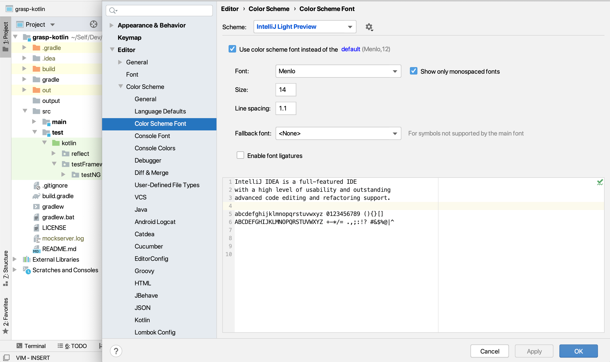

_This post shows how I prefer to set up my dev environment on Mac OS and settings and workflows that
I follow to maximize my productivity. </br></br>_

As a programmer, we spend most of the hours of our waking life staring at that laptop/desktop screen
working with Terminal, IDE/Editors or sometimes out of necessity with docs and spreadsheets. Thus we
owe it to ourselves as developers to care about these tools and use them to their fullest extent
with settings that work for us.

Most of these apps come out of the box with settings and default values and while they work and get
the job done, it's always nice to make **these your own** by personalizing them to your tastes and
aesthetic values.

In this post, I wanted to share how I like my workstation to be set up and the settings which work
for me.

Some of these settings might be more relevant to the macOS context since that is the primary dev
machine I use, however, these features are available in one form or the other in even Windows/Linux.

Let's dig into it.

## System-wide preferences

## Display

### Resolution

I have a 15&#8242; 2017 MacBook Pro provided by my company as a laptop. The default display
resolution is approx. 1680 X 1050 and honestly at that resolution the text in finder and other system
apps is abysmally small.


To do a favor to my eyes, I like to have the resolution set to 1440 X 900. At this resolution,
honestly, the fonts are way more readable and you can appreciate the OS UI's or icons a bit more
than usual. 😉

#### How to setup:

1. Go to System preferences
2. Select Displays
3. Select Scaled under resolution
4. Select resolution as 1440 X 900


### Night Shift

Typically most desktop and mobile OS'es these days have the option to set a **night mode**, this is
intended to make the screen a tinge warmer in tone and reduce the amount of blue light emitted which
makes it easier on the eyes.

I like to have the Custom schedule selected and ensure, its always On. It's so much more comfortable
to see the screen for extended periods with this setting and is truly a lifesaver.

#### How to setup:

1. Go to System preferences
2. Select Displays
3. Select Night Shift
4. Select Schedule as Custom with From 12:00 AM to 11:59 PM
5. Choose the appropriate color temperature.


### Theme

While the world around us is going crazy with a new dark mode or theme every day. I like to stick to
the Light one.

There have been numerous studies done and
[blogs written about the readability benefits](https://blog.codinghorror.com/code-colorizing-and-readability/)
of having black text on a white background.

Thus as a preference, I like to use the default Light theme and coupled with Night Shift and decent
screen brightness, I can honestly not feel much of eye strain and have observed that it does help me
focus better on the piece of code or the document that I am working with currently.

There are a couple of distinct benefits IMHO:

1. Most of the apps, web pages have light themes. Having a Dark theme in a few apps/pages causes
   constant strain on your eye to **adjust** when you switch between a dark vs a light app.
2. Most of the dark themes have annoyingly bad color choices and sometimes cause the eye to hurt
   more than a sane light theme.

#### How to setup:

1. Go to System preferences
2. General
3. Select Appearance as Light


## Keyboard

### Function keys

[Apple 4th gen redesign of the MacBook pro](<https://en.wikipedia.org/wiki/MacBook_Pro#Fourth_generation_(Touch_Bar_and_USB-C)>)
brought with it the much-hated and underutilized feature called touch bar.

It's a neat concept and if used correctly does provide you a host of benefits by having interactive
controls based on different app screens.

However, it also meant that they had to do away with the physical function keys which are crucial to
any dev workflow. I have seen many Dev's struggle with the additional use of **Fn** key to get the
function keys on their dev tools and go with crazy key combinations like **Ctrl + Shift + Fn + F9**
just to debug the code. Crazy!

However, there is an easier workaround in place.

We can tell apple certain apps, where we want the Function keys like F1 .. F12 to be displayed.

#### How to set up

1. Go to system preferences
2. Select Keyboard
3. Select Shortcuts
4. Select Function Keys
5. Add all the editors or IDE's that need the Fn keys to be displayed by
   default.


### Switching Esc to Caps lock

I use vim bindings in most of the IDE's or Editors that I use on a day to day basis.

As such **Esc** becomes a crucial key to press all day long to switch between Insert and Command
mode. Having your pinky finger do this job is awfully straining and inefficient in the interest of
time.

In macOS, this is a trivial setting to implement and does not require any registry hacks like in
Windows.</br>

#### How to setup

1. Go to system preferences
2. Select Keyboard
3. Select Modifier Keys
4. Select Escape operation for the Caps Lock Key.</br>

Well, you might ask what about my Caps Lock operation. Turns out, I rarely use it. And also not
having _all caps in your sentences might just make you appear a much nicer person on the web_. 😉


## iTerm

I use iTerm and Zsh as my terminal and shell combination of choice.

To really go over the power of both these at hand would require a dedicated blog post, however below
is a quick snippet of the plugins I use currently with zsh in my `.zshrc` file

```zsh
plugins=(
  git
  zsh-syntax-highlighting
  zsh-autosuggestions
  brew
  osx
  extract
)
```

Again, I use the Atom One Light color scheme with power line fonts for iterm specifically Meslo LG M
DZ for power line which is essentially Menlo font with power line support.

## IDE

It's no secret that I am a big fan of the JetBrains suite of IDEs for my test automation
development. Wrote a
[blog post about IntelliJ Idea features](http://automationhacks.blog/2020/01/26/using-intellij-to-speed-up-your-dev-workflow/)
some time back.

Quite simply I now prefer below visual settings on most of the Jetbrains editors at hand.

- **Scheme:** IntelliJ Light Preview
- **Font:** Menlo&nbsp;&nbsp;
- **Size:** 14
- **Line spacing:** 1.1



Over time, I have tried a variety of font faces like Fira code, Inconsolata, IBM Plex mono,
Jetbrains mono, Roboto mono, However, no font comes even close to Menlo in terms of the comfort
level I feel while coding on it.

I have since settled on using Menlo font and avoid spending the mandatory 15 mins tinkering with
font settings only having to go back to Menlo every single time.

## Single monitor

While the general dev world around is a big fan of multiple monitors in a variety of portrait and
landscape modes and I have used and experimented with my fair share of such setups

Over time what I've found is that for me a single monitor with a good resolution is very good for
the single-threaded focus (Read **inside the zone**) that I need to accomplish a task, Be it
churning out some code, or create documentation and whatnot.

I lack multiple ways of distraction (open IM clients like Slack, WhatsApp, etc) and have just a
single editor screen is amazing to work with focus.

I find the use of **Distraction-free mode (Jetbrains IDE) and Zen mode (VS Code)** to be quite
useful to further reduce distractions while working.

Below is the setup I use at work and have single started closing the MacBook in clamshell mode with
the use of a single LG Ultra monitor paired with an Akko 3068 mechanical keyboard and mouse.&nbsp;

Better still, this allows for better posture while working than the bent neck.

<div class="embed-twitter">
  <blockquote class="twitter-tweet" data-width="550" data-dnt="true">
    <p lang="en" dir="ltr">
      Office desk setup! <a href="https://t.co/DFyYtLCsqZ">pic.twitter.com/DFyYtLCsqZ</a>
    </p>&mdash; Gaurav Singh (@automationhacks) 
    
    <a href="https://twitter.com/automationhacks/status/1222374221893881856?ref_src=twsrc%5Etfw">January 29, 2020</a>
  </blockquote>
</div>

## Vimium:

Another browser extension that I use a lot is vimium, this basically adds VIM command superpowers to
my workflow, allowing me to select different controls on the browser without touching the trackpad
or mouse and using keyboard shortcuts and commands to drive the browser.

It saves me a lot of time. If interested. Check it out
<a href="https://chrome.google.com/webstore/detail/vimium/dbepggeogbaibhgnhhndojpepiihcmeb?hl=en" target="_blank" rel="noopener">here</a>

## Pomodoro:

One of my recent revelations about how I work more effectively is the use of focussed time blocks
interleaved with regular breaks.

This technique worldwide is used as the
<a href="https://francescocirillo.com/pages/pomodoro-technique" target="_blank" rel="noopener">Pomodoro
technique</a> and while there are a bunch of apps to facilitate this, I like to keep it simple and
use a Mac App called
<a href="https://apps.apple.com/us/app/horo-timer-for-menu-bar/id1437226581?mt=12" target="_blank" rel="noopener">Horo</a>
to start blocks of 25 mins work with 5 min break and followed by a longer break after 4 such
sessions.

This allows me to be able to get more done without feeling overly tired and overall allows me to be
much more relaxed at work. Apart from this. I have started planning my day by blocking time slots in
Google calendar, Allowing me visibility into the tasks I need to get done within a typical workday
instead of zoning from one to another without a plan.

> <p class="b-qt qt_165865">
>   If you don't know where you are going, any road will get you there.
> </p>
>
> <p class="bq_fq_a">
>   <a class="qa_165865 oncl_a" href="https://www.brainyquote.com/authors/lewis-carroll-quotes">Lewis Carroll</a>
> </p>

## Conclusion:

Putting all the customizations that I use on a day to day basis might really need multiple posts.

For now, this post gives a fair snapshot of my beliefs in 2020. I would treat this post as live
documentation and might change or add some things here as my mindset evolves.

Obviously, these reflect my world view at the moment and work well for me.

What do you think? What other customizations do you make or use in your dev environments? I would be
very curious to learn about these and hopefully learn and adapt some for my own needs.

If you found this post interesting, Do share it with a friend or colleague. Until next time. Cheers!
