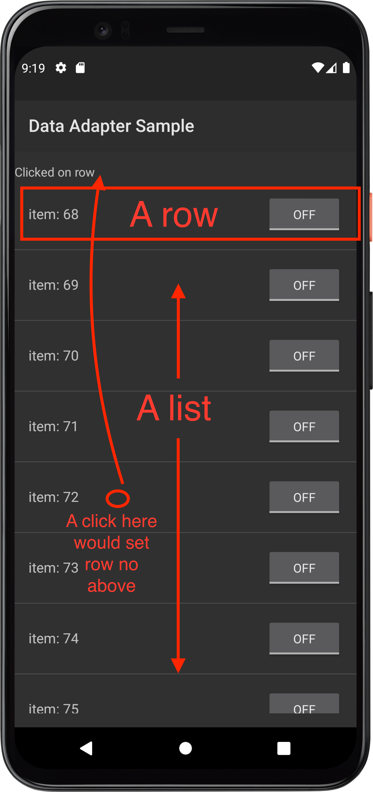
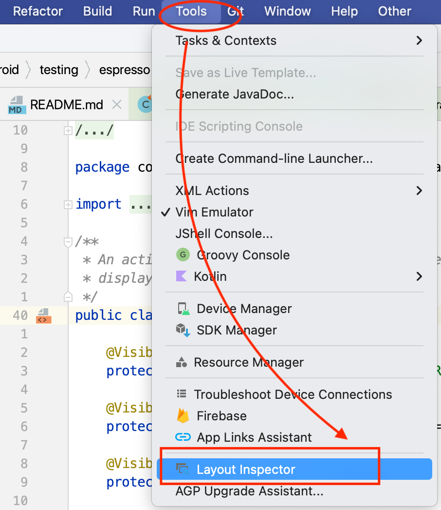
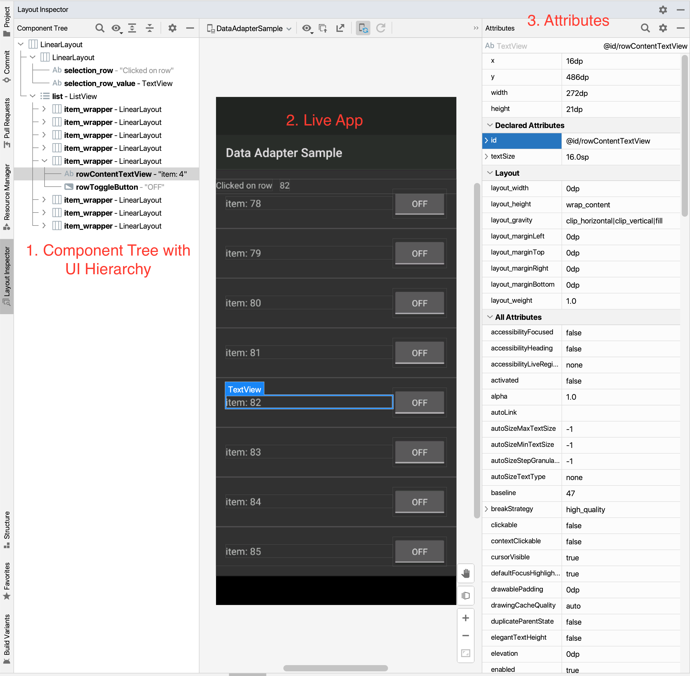
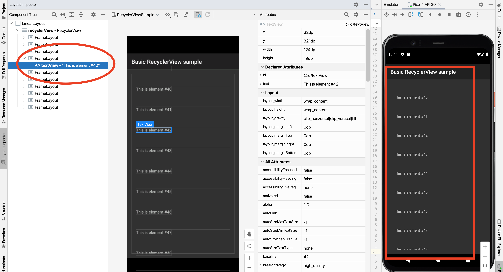
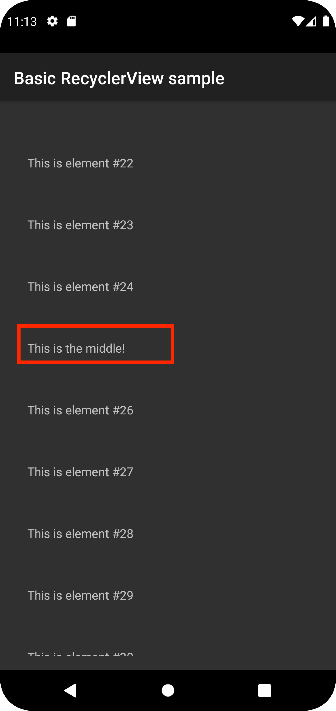

<figure class="image">
    
    <figcaption>
        Photo by <a
            href="https://www.google.com/imgres?imgurl=https%3A%2F%2Fmiro.medium.com%2Fmax%2F600%2F1*Z2iFvuo4pMsK-aYhPkiGWA.png&imgrefurl=https%3A%2F%2Fproandroiddev.com%2Ftesting-android-ui-with-pleasure-e7d795308821&tbnid=2m9PR31uA1zqGM&vet=12ahUKEwjtm9SLnMT3AhVE8IUKHREuDVUQMygAegUIARCpAQ..i&docid=cWI2R5HvetOtGM&w=600&h=692&q=espresso%20android&ved=2ahUKEwjtm9SLnMT3AhVE8IUKHREuDVUQMygAegUIARCpAQ">Pro Android Dev</a>
    </figcaption>
</figure>

In the previous post [Hello, espresso! Part 1 Introducing you to the world of espresso automation! ]()

We read an introduction to espresso, and understood how to write a basic test
flow in espresso. We also saw the structure of an espresso test

In this post, we'll dive into how to automate tests and work with list like
components using espresso. Examples of such components are `AdapterView`,
`RecyclerView` etc

Let's go! 🏃🏃‍♀️

## Working with lists in general

Using espresso, we can scroll to or perform an action on a given item in a list

We need this since sometimes the view you are interested in may not be present
on the screen and espresso needs to scroll to it based on some matcher.

There are some nuances to this though:

- Android lists are created with `RecyclerView` only a small no of child
  elements are created and they are recycled as you scroll. For these use cases,
  we can use `onView` with `RecyclerViewActions`
- `AdapterView` has data backed by an Adapter, for this we use `onData` with a
  custom matcher based on the how the adapter is designed

For these use cases `scrollTo` the method won't work since that needs an
existing view

Let's see an example and walk through how we could use espresso to scroll and
act on elements for these types of components

## Working with `AdapterView`

We'll use `DataAdapterSample` for this post. You can find the app and test code
at
[this](https://github.com/automationhacks/testing-samples/tree/main/ui/espresso/DataAdapterSample)
path in my forked Github repo

### Understanding the app under test

Once you load the project in android studio and let gradle build it, you can run
the app and see it load up on the emulator


Let's understand the flow we want to automate a bit better

- we have a `ListView` component where each row has a `TextView` and a
  `ToggleButton`
- You can scroll in this list
- Once you tap on a row, there is a `LinearLayout` at the top that's set with
  the row no



Assume that we want to automate this flow

### Using Layout Inspector to figure out the app structure

You don't need to dive into the source code to figure out how everything would
render on the UI when the app is built

Android studio provides a convenient tool called **Layout Inspector**, that
allows us to inspect the **Component Tree**. (Kind of similar to
[Appium Inspector](https://github.com/appium/appium-inspector)) You can open it
by going to **Tools > Layout Inspector**, You'll also need to select the process
you want to inspect (In this case you can select `DataAdapterSample`)

#### Open layout inspector



#### Understanding the UI



The layout inspector has 3 main sections:

1. **Component Tree:** Here we can see the tree like structure that makes up our
   current screen, we can observe the `ListView` with `TextView` and `Button`
   and the static `LinearLayout` on top
2. **Live App:** This section is refreshed as you interact with your app in the
   emulator, you can select any particular row and it would highlight the same
   in Component Tree and also show the attributes
3. **Attributes:** Here we can see all the attributes or properties of the given
   element and use these while automating our tests in espresso

### Writing our test for AdapterView

Let's write our tests to perform the actions mentioned above

We'll use a series of learning tests to explore how to test different aspects of
this app and test and also learn espresso's API a bit better, in a real test you
may just write one test to perform the workflow you intend to test.

You can see the complete test file
[here](https://github.com/automationhacks/testing-samples/blob/main/ui/espresso/DataAdapterSample/app/src/sharedTest/java/com/example/android/testing/espresso/DataAdapterSample/DataAdapterPractice.java)
with some helpful comments explaining what each test is supposed to do

#### Test control to be scrolled to is not visible

To start we want to create the usual structure i.e. Write our class
`DataAdapterPractice` with `@RunWith` annotation and use `ActivityScenarioRule`
to start our `LongListActivity` activity

```java
@RunWith(AndroidJUnit4.class)
@LargeTest

public class DataAdapterPractice {
    @Rule
    public ActivityScenarioRule<LongListActivity> rule = new ActivityScenarioRule<>(LongListActivity.class);
    ...
```

Before we try scrolling, it may be helpful to verify that the item that we want
to scroll to (say a TextView with text: `item: 99`) does not exist, we can do
that with below line:

```java
onView(withText("item: 99")).check(doesNotExist());
```

Here is the complete test:

```java
@RunWith(AndroidJUnit4.class)
@LargeTest

public class DataAdapterPractice {
    @Rule
    public ActivityScenarioRule<LongListActivity> rule = new ActivityScenarioRule<>(LongListActivity.class);

    @Test
    public void whenAppOpens_ThenLastItemIsNotDisplayed() {
        onView(withText("item: 99")).check(doesNotExist());
    }
}
```

#### Test we are able to scroll to last item

Next, we want to be able to scroll to the last item with text `item: 99`, we can
figure out this text by actually scrolling in the app and then seeing the value
of `text` attribute in the layout inspector

If we see the code for
[`LongListActivity`](https://github.com/automationhacks/testing-samples/blob/main/ui/espresso/DataAdapterSample/app/src/main/java/com/example/android/testing/espresso/DataAdapterSample/LongListActivity.java)
we can see that the `ListView` gets its data from an adapter `LongListAdapter`
that has a hash map keys like `ROW_TEXT` and `ROW_ENABLED`

We can use this understanding to write our matcher to find this row

- To scroll to such an element we use `onData` instead of `onView` (since the
  element is not displayed on the view)
- In our test, We want to find the element whose `ROW_TEXT` is `item:99` and we
  can do so using `hasEntry` Hamcrest matcher that is able to match elements in
  a hash map

```java
onData(hasEntry(equalTo(LongListActivity.ROW_TEXT), is("item: 99")))
```

- Espresso would take care of automatically scrolling to this element for us
- We can then close the flow by checking that such a row is visible by using
  below `ViewAssertion`

```java
.check(matches(isCompletelyDisplayed());
```

Below is how the complete test looks like:

```java
@RunWith(AndroidJUnit4.class)
@LargeTest

public class DataAdapterPractice {
    @Rule
    public ActivityScenarioRule<LongListActivity> rule = new ActivityScenarioRule<>(LongListActivity.class);

    @Test
    public void whenScrollToLastItem_ThenLastItemIsDisplayed() {
        // We use onData since we want to scroll to an item in the list view
        // we use hasEntry matcher that takes two args, first the item check
        // and second the value
        onData(hasEntry(equalTo(LongListActivity.ROW_TEXT), is("item: 99")))
                // Then we check that this entry is displayed
                .check(matches(isCompletelyDisplayed()));
    }
}
```

#### Click on a row and verify the LinearLayout has expected test

If the user taps on a particular element in the ListView then the app updates
the row no in a separate TextView with id: `selection_row_value`

We can repeat similar steps to scroll to the element with text value 30, tap on
it and then check if the TextView at the top is updated with the correct value

To click on a child element inside a ListView we can use `onChildView()` method
like below:

```java
.onChildView(withId(R.id.rowContentTextView)).perform(click());
```

Below is how the complete test looks like:

```java
@RunWith(AndroidJUnit4.class)
@LargeTest

public class DataAdapterPractice {
    @Rule
    public ActivityScenarioRule<LongListActivity> rule = new ActivityScenarioRule<>(LongListActivity.class);

    @Test
    public void whenClickOnRow_ThenTheTextIsUpdated() {
        String itemToClickOn = "item: 30";
        onData(hasEntry(equalTo(LongListActivity.ROW_TEXT), is(itemToClickOn)))
                // To click on an element in the list use `onChildView`
                .onChildView(withId(R.id.rowContentTextView)).perform(click());

        // Now that we are on desired item, we can verify using onView method
        String expectedValueAfterClick = "30";
        onView(withId(R.id.selection_row_value)).check(matches(withText(expectedValueAfterClick)));
    }
}
```

## Working with `RecyclerView`

`RecyclerView` is a different type of list which ensures when the user scrolls
off a screen, it recycles elements in an efficient manner. We do not use
`onData` in this case. To understand how `RecyclerView` works you could read
[this](https://developer.android.com/guide/topics/ui/layout/recyclerview) post
on Android developers

To work with `RecyclerView`, we can use `espresso-contrib` package in our app's
gradle dependencies

```groovy
androidTestImplementation 'androidx.test.espresso:espresso-contrib:' + rootProject.espressoVersion;
```

The dependency supports below actions:

### Scrolling in a `RecyclerView`

- `scrollTo()` - Scroll to matched view
- `scrollToHolder()` - Scroll to matched view holder
- `scrollToPosition()` - Scroll to specific position

### Performing action on element

- `actionOnItem()` - Perform view action on matched view
- `actionOnHolderItem()` - Perform view action on a matched View holder
- `actionOnItemAtPosition()` - Perform a view action on a view at a specific
  position

### App under test

For these tests, we'll use
[`RecyclerViewSample`](https://github.com/automationhacks/testing-samples/tree/main/ui/espresso/RecyclerViewSample)
test app



In this test app, we have a `RecyclerView` where each row is a `TextView` having
text like `This is element #42`, as the user scrolls the same elements are
recycled and reused by Android framework

### Learning tests

Let's write some tests for this app

#### Test that a given element is not present in the list and espresso throws an exception

We'll start with a negative test, what if we try to scroll to an element that
does not exist, we should expect espresso framework to throw an exception in
this case, this test also is a good way to demo the `scrollTo` method in
`RecyclerViewActions`

- We use `onView` to find our RecyclerView (getting its id via layout inspector)

```java
onView(withId(R.id.recyclerView))
```

- We then use `scrollTo` method in `RecyclerViewActions` and use `hasDescendant`
  `ViewMatcher` to check that a hypothetical element with text `not on the list`
  is present. Naturally this throws an exception and we handle that by adding
  `@Test(expected = PerformException.class)` in the JUnit test assertion

```java
.perform(RecyclerViewActions.scrollTo(hasDescendant(withText("not on the list"))));
```

Below is th how the complete test looks like:

```java
@RunWith(AndroidJUnit4.class)
public class RecyclerViewSamplePracticeTest {

  @Rule
  public ActivityScenarioRule activityScenarioRule = new ActivityScenarioRule<>(MainActivity.class);

  /**
   * This is a negative test that tries to scroll to a descendant that does not exist in the app We
   * use Junit @Test annotation to verify that this test throws a PerformException
   */
  @Test(expected = PerformException.class)
  public void whenAppOpens_ThenItemWithTextIsNotVisible() {
    onView(withId(R.id.recyclerView))
        // Here scrollTo will fail if there are no items that match expected descriptions
        .perform(RecyclerViewActions.scrollTo(hasDescendant(withText("not on the list"))));
  }
}
```

#### Test we can scroll to a fixed position and click on it and check its displayed

Let's say we want to scroll into our list to the 40th item and click on it, we
use `actionOnItemAtPosition` method to specify the position and also add the
`click()` method to click that

```java
onView(withId(R.id.recyclerView))
        .perform(RecyclerViewActions.actionOnItemAtPosition(itemBelowFold, click()));
```

We can then check if the item with expected text is displayed using below:

```java
String expectedText = String.format("This is element #%d", itemBelowFold);
onView(withText(expectedText)).check(matches(isDisplayed()));
```

Below is how the complete test looks like:

```java
@RunWith(AndroidJUnit4.class)
public class RecyclerViewSamplePracticeTest {

  @Rule
  public ActivityScenarioRule activityScenarioRule = new ActivityScenarioRule<>(MainActivity.class);

  /**
   * Test to scroll in a recycler view to an item at a fixed position And verify that the element
   * with expected text is displayed
   */
  @Test
  public void whenScrollToItemAtAPosition_ThenItemIsDisplayed() {
    int itemBelowFold = 40;
    onView(withId(R.id.recyclerView))
        .perform(RecyclerViewActions.actionOnItemAtPosition(itemBelowFold, click()));

    String expectedText = String.format("This is element #%d", itemBelowFold);
    onView(withText(expectedText)).check(matches(isDisplayed()));
  }
}
```

#### Test we can scroll to the middle using a custom matcher

Our app has a special row in the middle with a text: `This is the middle!`,
let's say we want to scroll to this elements holder and then verify its
displayed



We can use `scrollToHolder` and pass it a custom matcher to verify if it has
reached the middle

```java
onView(withId(R.id.recyclerView)).perform(RecyclerViewActions.scrollToHolder(isInTheMiddle()));
```

Let's see how `isInTheMiddle()` method is implemented

We create a new `TypeSafeMatcher` of type `CustomAdapter.ViewHolder` which
overridden implementation of `matchesSafely` that returns `getIsInTheMiddle()`
methods output. Note: The support for this method is added in apps source code

```java
private static TypeSafeMatcher<CustomAdapter.ViewHolder> isInTheMiddle() {
    return new TypeSafeMatcher<CustomAdapter.ViewHolder>() {
      @Override
      public void describeTo(Description description) {
        description.appendText("item in the middle");
      }

      @Override
      protected boolean matchesSafely(CustomAdapter.ViewHolder viewHolder) {
        return viewHolder.getIsInTheMiddle();
      }
    };
  }
```

To see the app impl supporting this, see
[`CustomAdapter`](https://github.com/automationhacks/testing-samples/blob/main/ui/espresso/RecyclerViewSample/app/src/main/java/com/example/android/testing/espresso/RecyclerViewSample/CustomAdapter.java)
class that has a method `onBindViewHolder` which sets this flag in
`viewHolder.setIsInTheMiddle(true);` if the `position == mDataSet.size() / 2`

Finally, we can check if the view is displayed using:

```java
String expectedText = String.format("This is element #%d", itemBelowFold);
onView(withText(expectedText)).check(matches(isDisplayed()));
```

Please see the complete test below:

```java
@RunWith(AndroidJUnit4.class)
public class RecyclerViewSamplePracticeTest {

  @Rule
  public ActivityScenarioRule activityScenarioRule = new ActivityScenarioRule<>(MainActivity.class);

  /**
   * This test scrolls in recycler view till it finds an element with text: "This is the middle!" It
   * uses a field already set in the View holder implementation to determine it has reached the
   * point And a custom hamcrest matcher
   */
  @Test
  public void whenScrollToItemInTheMiddle_ThenCheckItemWithSpecialTextIsDisplayed() {
    onView(withId(R.id.recyclerView)).perform(RecyclerViewActions.scrollToHolder(isInTheMiddle()));

    onView(withText("This is the middle!")).check(matches(isDisplayed()));
  }

  private static TypeSafeMatcher<CustomAdapter.ViewHolder> isInTheMiddle() {
    return new TypeSafeMatcher<CustomAdapter.ViewHolder>() {
      @Override
      public void describeTo(Description description) {
        description.appendText("item in the middle");
      }

      @Override
      protected boolean matchesSafely(CustomAdapter.ViewHolder viewHolder) {
        return viewHolder.getIsInTheMiddle();
      }
    };
  }
}
```

## Further reads

You can read
[Espresso lists on Android developers](https://developer.android.com/training/testing/espresso/lists)

## Conclusion

Hopefully this post gives you an idea on how to work with list like components
in espresso. Stay tuned for next post where we’ll dive into how to automate and
work with **intents** with espresso

As always, Do share this with your friends or colleagues and if you have
thoughts or feedback, I’d be more than happy to chat over at twitter or
comments. Until next time. Happy Testing and coding.
