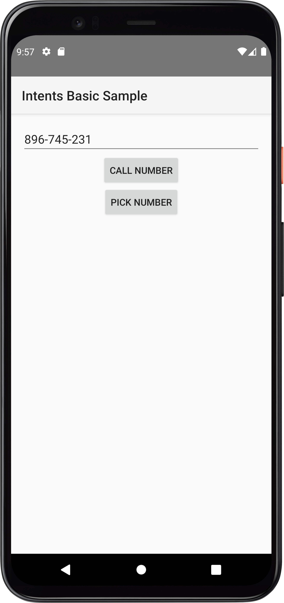
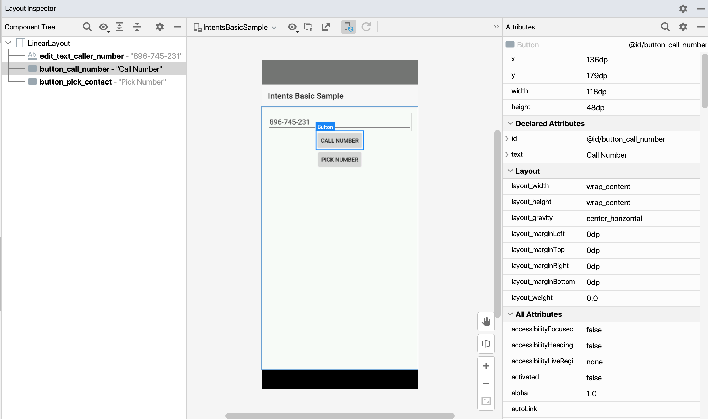

<figure class="image">
    
    <figcaption>
        Photo by <a
            href="https://www.google.com/imgres?imgurl=https%3A%2F%2Fmiro.medium.com%2Fmax%2F600%2F1*Z2iFvuo4pMsK-aYhPkiGWA.png&imgrefurl=https%3A%2F%2Fproandroiddev.com%2Ftesting-android-ui-with-pleasure-e7d795308821&tbnid=2m9PR31uA1zqGM&vet=12ahUKEwjtm9SLnMT3AhVE8IUKHREuDVUQMygAegUIARCpAQ..i&docid=cWI2R5HvetOtGM&w=600&h=692&q=espresso%20android&ved=2ahUKEwjtm9SLnMT3AhVE8IUKHREuDVUQMygAegUIARCpAQ">Pro Android Dev</a>
    </figcaption>
</figure>

Things are getting pretty exciting 😁 as we work our way through learning
espresso's API

In the last part [Hello, espresso! Part 2 Working with
lists](),
we learned how to work with list controls (`RecyclerView`, `AdapterView`) in
espresso. Go ahead and have a read in case you missed it.

## Learning to test Intents 💪

In this post, we'll understand how to automate testing of intents using
espresso.

[`espresso-intents`](https://mvnrepository.com/artifact/androidx.test.espresso/espresso-intents)
provides us the capabilities to validate intents for a couple of important use
cases:

- Test whether the correct intent is invoked with valid data by our app
- Or, even stub out the intents sent out so that we can verify only our apps
  logic (while assuming other apps that we depend upon have been tested
  independently)

## What is an Android intent?

In
[developer.android.com's post about Android Intents](https://developer.android.com/reference/android/content/Intent)

> An intent is an abstract description of an operation to be performed.
>
> It can be used:
>
> - with `startActivity` to launch an Activity,
> - `broadcastIntent` to send it to any interested `BroadcastReceiver`
>   components,
> - and `Context.startService(Intent)` or
>   `Context.bindService(Intent, ServiceConnection, int)` to communicate with a
>   background Service.

One of the use cases for which **Intents** are used a lot is to **launch
Activities** and they can be thought is a data structure that holds an abstract
description of an action to be performed

There are 2 components to an Intent:

- **Action:** What action has to be performed, some examples of this are:
  - [`ACTION_VIEW`](https://developer.android.com/reference/android/content/Intent#ACTION_VIEW)
    displays data to the user, for instance, if we use it as `tel: URI` it will
    invoke the dialer (we'll see this in our test example),
  - [`ACTION_EDIT`](https://developer.android.com/reference/android/content/Intent#ACTION_EDIT)
    gives explicit edit access to given data
- **Data:** Data to operate on expressed as a
  [`Uri`](https://developer.android.com/reference/android/net/Uri)

You can read the full doc
[here](https://developer.android.com/reference/android/content/Intent) to
understand more about Intents

## Understanding our App under test 🕵🏻

Let's start by understanding the app under test

We'll use
[`IntentsBasicSample`](https://github.com/automationhacks/testing-samples/tree/main/ui/espresso/IntentsBasicSample)
app, which has an `EditText` to enter a phone no and a `Button` to either call a
number or randomly pick a no, if the user taps on the call number button it launches a
dialer app




The below scenarios are possible

```text
GIVEN user is on home screen
WHEN user taps on enter phone no EditText with id: @id/edit_text_caller_number
AND user types a valid phone no
AND user taps on call number Button with id: id @id/button_call_number
THEN the dialer activity is shown with entered phone no
```

> I've written this in Gherkin syntax for clarity, however in a live test, the
> tests should always describe behavior and no be as procedural as i've written
> below. Read [this](https://cucumber.io/docs/bdd/better-gherkin/) page on
> cucumber website to understand more

Let's use Layout inspector to grab the selectors for the elements we want to
work with:



## Add required dependencies

We need to add `espresso-intents` dependency to our `app/build.gradle` file as
below, also it's only compatible with espresso `2.1+` and android testing lib
version `0.3+`, so we need to double-check their versions in our dependencies as
well

```java
androidTestImplementation 'androidx.test.espresso:espresso-intents:3.4.0'
androidTestImplementation 'androidx.test:runner :1.4.0'
androidTestImplementation 'androidx.test:rules:1.4.0'
androidTestImplementation 'androidx.test.espresso:espresso-core:3.4.0'
```

## Test to launch a dialer activity using intents and validation

Below is the complete test to perform our scenario, don't worry 🧘🏻‍♂️ if it does
not make sense right now, we'll unpack this in detail below, the complete
example is mentioned so that you can skim through its structure first before we
dive deeper

```java
@RunWith(AndroidJUnit4.class)
@LargeTest
public class DialerActivityPracticeTest {
  public static final String VALID_PHONE_NUMBER = "123-456-7898";

  @Rule
  public GrantPermissionRule grantPermissionRule =
      GrantPermissionRule.grant("android.permission.CALL_PHONE");

  @Rule
  public ActivityScenarioRule<DialerActivity> testRule =
      new ActivityScenarioRule<>(DialerActivity.class);

  @Before
  public void setupIntents() {
    // Initializes intents and begins recording intents, must be called before
    // triggering any actions that call an intent that we want to verify with validation or stubbing
    init();
  }

  @After
  public void teardownIntents() {
    // Clears intent state, must be called after each test case
    release();
  }

  /** Test to enter a phone number and make a call and verify an intent is launched */
  @Test
  public void whenTapOnCallNumber_ThenOutgoingCallIsMade() {
    // Type a phone no and close keyboard
    Uri phoneNumber = Uri.parse("tel:" + VALID_PHONE_NUMBER);
    onView(withId(R.id.edit_text_caller_number)).perform(typeText(VALID_PHONE_NUMBER), closeSoftKeyboard());

    // Tap on call number button
    onView(withId(R.id.button_call_number)).perform(click());

    // Verify an intent is called with action and phone no and package
    intended(allOf(hasAction(Intent.ACTION_CALL), hasData(phoneNumber)));
  }
}
```

### Setting up intents and permissions

- Just like `Views`, we'll use JUnit rules to set up and tear down our intents
  before and after each test. We'll use `ActivityScenarioRule` for this
- Since we want to automate the `DialerActivity` class, we'll pass that as the
  generic type within `<>`

```java
@Rule
  public ActivityScenarioRule<DialerActivity> testRule =
      new ActivityScenarioRule<>(DialerActivity.class);
```

- ❗️However just adding the rule is not enough and we need to set up and
  tear down our intents before and after a test as well
  - We use `@Before` and `@After` JUnit annotations for this purpose and call
    `init()` before our test starts to execute and `release()` after the test
    has been executed

> Note: If you read other blogs and even the
> [official google guide on espresso-intents](https://developer.android.com/training/testing/espresso/intents#test-rules),
> they show usage of
> [`IntentsTestRule`](https://developer.android.com/reference/androidx/test/espresso/intent/rule/IntentsTestRule)
> for setting up intents, but this has recently been deprecated with suggestion
> to use `ActivityScenarioRule` with `init()` and `release()`. I'm sure these
> examples and docs would get updated soon, you can meanwhile refer to this blog
> 😉. You can see
> [this commit](https://github.com/automationhacks/testing-samples/commit/1208e91d3d2da218ddecca31795e10dd8a7a2d97)
> to understand how your test code would look like prior and after this change.

```java
@Before
  public void setupIntents() {
    // Initializes intents and begins recording intents, must be called before
    // triggering any actions that call an intent that we want to verify with validation or stubbing
    init();
  }

  @After
  public void teardownIntents() {
    // Clears intent state, must be called after each test case
    release();
  }
```

- We also want our test to have permission to make a call and thus add below
  snippet as another JUnit rule to ensure we don't get any permission errors
  during our test run

```java
@Rule
public GrantPermissionRule grantPermissionRule = GrantPermissionRule.grant("android.permission.CALL_PHONE");
```

### Writing core test logic

With that taken care of let's write our test

We store a test number in a static variable

```java
public static final String VALID_PHONE_NUMBER = "123-456-7898";
```

We'll type the phone no into our EditText as below and then close the keyboard:

```java
onView(withId(R.id.edit_text_caller_number)).perform(typeText(VALID_PHONE_NUMBER), closeSoftKeyboard());
```

We'll then tap the call number button

```java
// Tap on call number button
onView(withId(R.id.button_call_number)).perform(click());
```

### Asserting our intent was fired

Great 🙌🏼, we want to verify that our Intent was actually invoked and we can
achieve that by using `intended` method that takes an Intent matcher (either an
existing one or one that we define).

> Tip: 💡 You can refer to
> [Hamcrest Tutorial](https://code.google.com/archive/p/hamcrest/wikis/Tutorial.wiki)
> understand how hamcrest matchers work since we are going to use them heavily
> with espresso

```java
// Verify an intent is called with action and phone no and package
intended(allOf(hasAction(Intent.ACTION_CALL), hasData(phoneNumber)));
```

If you notice, we use `allOf()` matcher, that checks that the examined object
matches **all of the specified matchers**

We first check that the `intent` had the correct action by calling
`hasAction(Intent.ACTION_CALL)`

How do we know which action to assert? 🤔

We can look into app source in
[`DialerActivity`](https://github.com/automationhacks/testing-samples/blob/main/ui/espresso/IntentsBasicSample/app/src/main/java/com/example/android/testing/espresso/IntentsBasicSample/DialerActivity.java)
to understand more details about our intent

If you look at `createCallIntentFromNumber` method, you can see we create an
intent with action `Intent.ACTION_CALL`:

```java
final Intent intentToCall = new Intent(Intent.ACTION_CALL);
```

Also, we see that we set a phone no as the intents data in:

```java
intentToCall.setData(Uri.parse("tel:" + number));
```

Here is the full method for reference

```java
private Intent createCallIntentFromNumber() {
  final Intent intentToCall = new Intent(Intent.ACTION_CALL);
  String number = mCallerNumber.getText().toString();
  intentToCall.setData(Uri.parse("tel:" + number));
  return intentToCall;
}
```

We also assert that our intent has the correct phone no set as data by:

Preparing the phone no `Uri` earlier

```java
Uri phoneNumber = Uri.parse("tel:" + VALID_PHONE_NUMBER);
```

and then add the below line in our `allOf` matcher

```java
hasData(phoneNumber)
```

## Stubbing intent response

If you run this test, you'll see the Dialer Activity pop up

In the above test, we saw how espresso intents could launch another activity and
we can quickly validate them using `intended`,

However, If we only care about testing the logic of our app and not so much about a 3rd
party apps logic (since we anyways
[cannot manipulate the UI](https://stackoverflow.com/questions/24992821/how-to-use-espresso-for-testing-a-3rd-party-app)
of external activity, nor control the `ActivityResult` returned to the
activity we are testing), then espresso allows us to stub intents and returns a
mock response as well using `intending`

Let's see how we can do this:

We add the below line in our `@Before` annotated setup method:

```java
intending(not(isInternal()))
  .respondWith(new Instrumentation.ActivityResult(Activity.RESULT_OK, null));
```

Let's understand its nuts and bolts:

- We can configure espresso to return a `RESULT_OK` for any intent call by using
  `isInternal()` intent matcher that checks **if an intents package is the same
  as the target package for the instrumentation test.**
  - Since in this case, we want to stub out all intent calls to other activities
    we can wrap this with a `not()` so ensure we inverse the result of the
    matcher
- We then ask espresso to return a `RESULT_OK` as a stubbed response by using
  `respondWith()` and mention the result we want to return:

```java
.respondWith(new Instrumentation.ActivityResult(Activity.RESULT_OK, null));
```

Here:

- `Activity.RESULT_OK` is the `resultCode` and
- `null` is the resultData since we don't want to return anything in the intent
  response

If we rerun the above test, you'll see that no dialer activity is started since the
intent call to external activities is going to be stubbed

## Test our own apps intent without making an external activity call a.k.a Stubbing response

Let's see another example of stubbing using `intending` updated functional test
flow

```text
GIVEN user is on home screen
WHEN user taps on pick number Button with id: @id/button_pick_contact
THEN we check that an intent call was made
AND we verify intent response from Contacts Activity is stubbed
```

We can write the below test to achieve this flow:

```java
@RunWith(AndroidJUnit4.class)
@LargeTest
public class DialerActivityPracticeTest {
  public static final String VALID_PHONE_NUMBER = "123-456-7898";

  @Rule
  public GrantPermissionRule grantPermissionRule =
      GrantPermissionRule.grant("android.permission.CALL_PHONE");

  @Rule
  public ActivityScenarioRule<DialerActivity> testRule =
      new ActivityScenarioRule<>(DialerActivity.class);

  @Before
  public void setupIntents() {
    // Initializes intents and begins recording intents, must be called before
    // triggering any actions that call an intent that we want to verify with validation or stubbing
    init();
  }

  @After
  public void teardownIntents() {
    // Clears intent state, must be called after each test case
    release();
  }

  @Test
  public void whenPickNumber_AndTapOnCallWithStub_ThenStubbedResponseIsReturned() {
    // To stub all intents to contacts activity to return a valid phone number
    // we use intending() and verify if component has class name ContactsActivity
    // then we responding with valid result
    intending(hasComponent(hasShortClassName(".ContactsActivity")))
        .respondWith(
            new Instrumentation.ActivityResult(
                Activity.RESULT_OK, ContactsActivity.createResultData(VALID_PHONE_NUMBER)));

    onView(withId(R.id.button_pick_contact)).perform(click());
    onView(withId(R.id.edit_text_caller_number)).check(matches(withText(VALID_PHONE_NUMBER)));
  }
}
```

In this example, we show that we could also selectively stub out intent calls to
a particular activity, e.g. if we wanted all calls to `ContactsActivity` to
return a code: `RESULT_OK` and a valid phone no, we can do so by writing:

```java
intending(hasComponent(hasShortClassName(".ContactsActivity")))
        .respondWith(
            new Instrumentation.ActivityResult(
                Activity.RESULT_OK, ContactsActivity.createResultData(VALID_PHONE_NUMBER)));
```

> Note: If we want to stub calls to all classes in a package we could use:
> `toPackage` method inside `intending`

```java
intending(toPackage("com.android.contacts")).respondWith(result);
```

Here we use `hasComponent(hasShortClassName(".ContactsActivity"))` that matches
any call to class `ContactsActivity` and respond with `RESULT_OK`, also we
return `resultData` as the return value of `createResultData` method

If we see impl of `createResultData` in `ContactsActivity` source code, we see
it returns an empty intent with a phone no value

```java
@VisibleForTesting
    static Intent createResultData(String phoneNumber) {
        final Intent resultData = new Intent();
        resultData.putExtra(KEY_PHONE_NUMBER, phoneNumber);
        return resultData;
    }
```

We finally tap on the pick number button and verify that the `EditText` button has
the same no as the one returned by the stubbed intent call

And that's how you automate intents with espresso! ✅

## Resources

- You can find the app and test code for this post on Github:
  - [App](https://github.com/automationhacks/testing-samples/tree/main/ui/espresso/IntentsBasicSample)
  - [Test code](https://github.com/automationhacks/testing-samples/blob/main/ui/espresso/IntentsBasicSample/app/src/sharedTest/java/com/example/android/testing/espresso/IntentsBasicSample/DialerActivityPracticeTest.java)
- Please read
  [espresso-intents](https://developer.android.com/training/testing/espresso/intents)
  that talks about how to work with intents on Android developers
- Refer to original source code on
  [testing-samples](https://github.com/android/testing-samples)
  - [IntentsBasicSample](https://github.com/android/testing-samples/tree/main/ui/espresso/IntentsBasicSample)
  - [IntentsAdvancedSample](https://github.com/android/testing-samples/tree/main/ui/espresso/IntentsAdvancedSample)

## Conclusion

Hopefully, this post gives you an idea of how to work with intents in espresso.
Stay tuned for the next post where we’ll dive into how to automate and work with
**idling resources** with espresso

As always, Do share this with your friends or colleagues and if you have
thoughts or feedback, I’d be more than happy to chat over on Twitter or
comments. Until next time. Happy Testing and learning.
