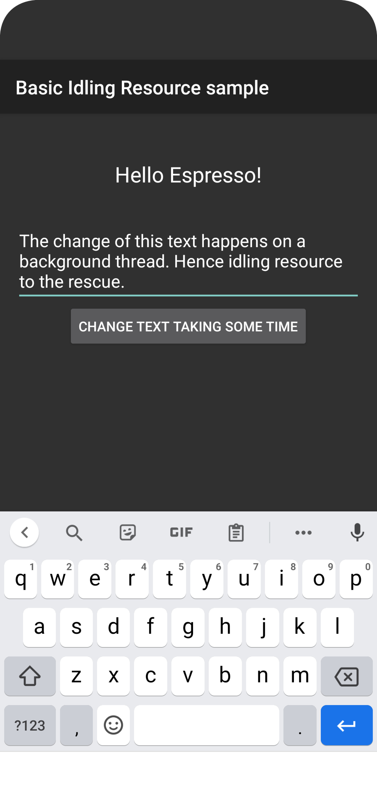
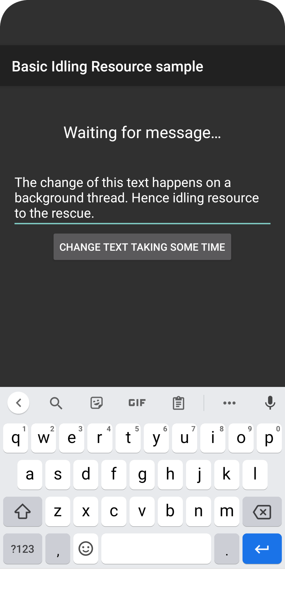
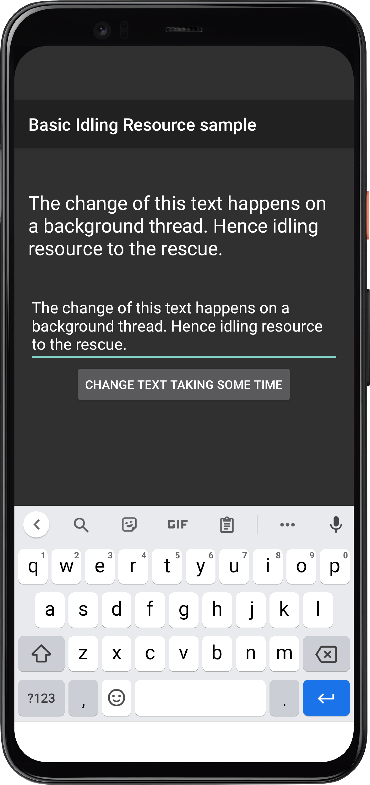
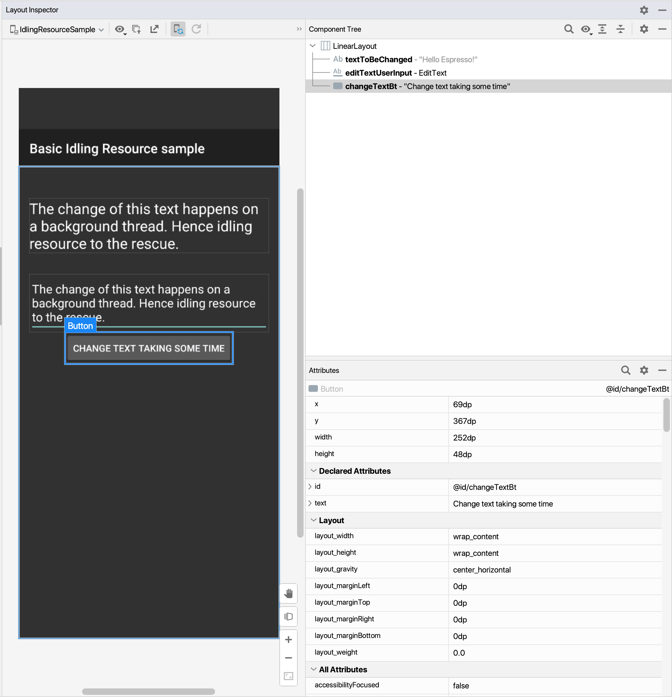

*Espresso logo image by
[ProAndroidDev](https://www.google.com/imgres?imgurl=https%3A%2F%2Fmiro.medium.com%2Fmax%2F600%2F1*Z2iFvuo4pMsK-aYhPkiGWA.png&imgrefurl=https%3A%2F%2Fproandroiddev.com%2Ftesting-android-ui-with-pleasure-e7d795308821&tbnid=2m9PR31uA1zqGM&vet=12ahUKEwjtm9SLnMT3AhVE8IUKHREuDVUQMygAegUIARCpAQ..i&docid=cWI2R5HvetOtGM&w=600&h=692&q=espresso%20android&ved=2ahUKEwjtm9SLnMT3AhVE8IUKHREuDVUQMygAegUIARCpAQ")\*

In the last part [Hello, espresso! Part 3 Working with
intents](),
we understood how to use espresso intents for both validation and stubbing. Go
ahead and have a read in case you missed it.

## Dealing with synchronization issues in espresso

Espresso is intelligent enough to take care of common synchronization cases for
us thus requiring test authors to put minimal synchronization code.

When we invoke `onView()`, espresso waits and checks for below conditions before
proceeding with assertions

- Is the message queue empty?
- Are there any instances of `AsyncTask` executing any tasks?
- Are all developer defined Idling resources idle?

While this is great for most of the use cases, Espresso still isn't aware of any
other async (asynchronous) operations that are running on a background thread
and to let espresso handle these conditions, we need to register each one as an
**Idling resource**

## A word of caution 👎🏼🚫

When trying to synchronize your tests with the app behaviors, It's possible that
you may look for a **quick workarounds** (some of these are listed below),
however I would encourage you to not use these and instead use Idling resources
as that would lead to much more maintainable and reliable tests:

- **Use `Thread.sleep()`** to put an artificial delay in your tests, This is a
  really bad idea since you don't in advance how much time an operation would
  take when run on slower devices and scales very poorly when the time taken by
  async operation changes in the future
- **Implement retry logic**: You may think, i'll keep a loop running that checks
  if the app is still performing async work until a timeout happens, many
  popular E2E frameworks like `Appium`, `Selenium` do use this approach. Again,
  its not very deterministic and can vary with device and network conditions
- **Using instances of
  [CountDownLatch](https://developer.android.com/reference/java/util/concurrent/CountDownLatch):**
  to wait until some no of operations executing on another thread are complete.
  These objects have a timeout and adds unnecessary complexity to your code
  increasing maintenance overhead

> Read
> [Android developers guide](https://developer.android.com/training/testing/espresso/idling-resource#identify-when-needed)
> for some more context on this

## When to use Idling resources

What are some of the common use cases when we could consider using Idling
resource? Glad you asked. Below are a few of them:

- Load data from internet
- Load data from local data source
- Establish connection with db and callbacks
- Manage services, either system or `IntentService`
- Perform complex business logic like bitmap transformations

If these operations update a UI that we want to validate, then we should
register them as Idling resource

## Let's write a test 🧑🏻‍💻

By now, it's clear that by using `IdlingResource`, we essentially make our test
wait until whatever operations an app is performing are completed, let's see a
practical example to wrap our heads around this:

### App under test

We are using a sample app similar to our very first example with extra logic to
demo Idling resource, You can find the app
[IdlingResourceSample](https://github.com/automationhacks/testing-samples/tree/main/ui/espresso/IdlingResourceSample)
and test case on Github

Assume that we need to automate below scenario:

```text
GIVEN user types "some text" in EditText with id: editTextUserInput
AND user taps on "Change text taking some time" Button (with id: changeTextBt)
THEN app displays entered text in TextView with id: textToBeChanged
```

Below is how the app looks for each of these steps:

- GIVEN user types "some text" in `EditText` with `id: editTextUserInput`



- AND user taps on "Change text taking some time" Button (with id: changeTextBt)
  - Notice: The app displays a temporary text `"Waiting for message...` as it
    waits for the background operation to complete



THEN app displays entered text in TextView with id: textToBeChanged



And this is how the layout inspector looks for this app



### The test that waits 🛑

Below is the complete test for this:

```java
package com.example.android.testing.espresso.IdlingResourceSample;

import static androidx.test.espresso.Espresso.onView;
import static androidx.test.espresso.action.ViewActions.click;
import static androidx.test.espresso.action.ViewActions.closeSoftKeyboard;
import static androidx.test.espresso.action.ViewActions.typeText;
import static androidx.test.espresso.assertion.ViewAssertions.matches;
import static androidx.test.espresso.matcher.ViewMatchers.withId;
import static androidx.test.espresso.matcher.ViewMatchers.withText;

import android.app.Activity;

import androidx.test.core.app.ActivityScenario;
import androidx.test.espresso.IdlingRegistry;
import androidx.test.espresso.IdlingResource;
import androidx.test.ext.junit.rules.ActivityScenarioRule;
import androidx.test.ext.junit.runners.AndroidJUnit4;

import org.junit.After;
import org.junit.Before;
import org.junit.Rule;
import org.junit.Test;
import org.junit.runner.RunWith;

@RunWith(AndroidJUnit4.class)
public class ChangeTextIdlingResourcePracticeTest {
    // We create a variable to hold an idling resource instance
    private IdlingResource mIdlingResource;

    /**
     * Before a test executes, we get idling resource from activity and register it into
     * the IdlingRegistry
     */
    @Before
    public void registerIdlingResource() {
        // We use ActivityScenario to launch and get access to our MainActivity
        ActivityScenario activityScenario = ActivityScenario.launch(MainActivity.class);

        // activityScenario.onActivity provides a thread safe mechanism to access the activity
        // We pass the activity as a lambda and then register it into idling registry
        activityScenario.onActivity((ActivityScenario.ActivityAction<MainActivity>) activity -> {
            mIdlingResource = activity.getIdlingResource();
            IdlingRegistry.getInstance().register(mIdlingResource);
        });
    }

    @Test
    public void whenUserEntersTextAndTapsOnChangeText_ThenTextChangesWithADelay() {
        // Type text in text box with type something ...
        String text = "This is gonna take some time";
        onView(withId(R.id.editTextUserInput)).perform(typeText(text), closeSoftKeyboard());

        // Tap on "Change text taking some time" button
        onView(withId(R.id.changeTextBt)).perform(click());

        // Assert the entered text is displayed on the screen
        onView(withId(R.id.textToBeChanged)).check(matches(withText(text)));

        /* NOTE: We'll get below error if we try to run this test without idling resources
         * androidx.test.espresso.base.AssertionErrorHandler$AssertionFailedWithCauseError: 'an instance of android.widget.TextView and view.getText()
         * with or without transformation to match: is "This is gonna take some time"' doesn't match the selected view.
           Expected: an instance of android.widget.TextView and view.getText() with or without transformation to match: is "This is gonna take some time"
           Got: view.getText() was "Waiting for message…"
         */
    }

    @After
    public void unregisterIdlingResource() {
        /**
         * After the test has finished, we unregister this idling resource
         * from the IdlingRegistry
         */
        if (mIdlingResource != null) {
            IdlingRegistry.getInstance().unregister(mIdlingResource);
        }
    }
}
```

What's the same?

If you notice the test
`whenUserEntersTextAndTapsOnChangeText_ThenTextChangesWithADelay`, you'll see it
is very similar to the first test that we wrote. If you need to refresh your
memory you could read the first part
[here]()

however if we just write that test and run using Android studio, we'll see
espresso throw an error like below:

```java
androidx.test.espresso.base.AssertionErrorHandler$AssertionFailedWithCauseError: 'an instance of android.widget.TextView and view.getText()
  * with or without transformation to match: is "This is gonna take some time"' doesn't match the selected view.
    Expected: an instance of android.widget.TextView and view.getText() with or without transformation to match: is "This is gonna take some time"
    Got: view.getText() was "Waiting for message…"
```

This is of course, since this app has a logic to simulate a delay between the
actual text being updated on the UI and while we expect our entered text to show
up, we instead see `Waiting for message…`

## Bonus: How does the app implement the delay?

If you are curious on how the app is implementing this:

There is a class `MessageDelayer`, that declares a `processMessage` method that
takes a string message, instance of a callback and an idlingResource

```java
package com.example.android.testing.espresso.IdlingResourceSample;

import android.os.Handler;
import androidx.annotation.Nullable;
import androidx.test.espresso.IdlingResource;

import com.example.android.testing.espresso.IdlingResourceSample.IdlingResource.SimpleIdlingResource;

/**
 * Takes a String and returns it after a while via a callback.
 * <p>
 * This executes a long-running operation on a different thread that results in problems with
 * Espresso if an {@link IdlingResource} is not implemented and registered.
 */
class MessageDelayer {

    private static final int DELAY_MILLIS = 3000;

    interface DelayerCallback {
        void onDone(String text);
    }

    /**
     * Takes a String and returns it after {@link #DELAY_MILLIS} via a {@link DelayerCallback}.
     * @param message the String that will be returned via the callback
     * @param callback used to notify the caller asynchronously
     */
    static void processMessage(final String message, final DelayerCallback callback,
            @Nullable final SimpleIdlingResource idlingResource) {
        // The IdlingResource is null in production.
        if (idlingResource != null) {
            idlingResource.setIdleState(false);
        }

        // Delay the execution, return message via callback.
        Handler handler = new Handler();
        handler.postDelayed(new Runnable() {
            @Override
            public void run() {
                if (callback != null) {
                    callback.onDone(message);
                    if (idlingResource != null) {
                        idlingResource.setIdleState(true);
                    }
                }
            }
        }, DELAY_MILLIS);
    }
}
```

## Resources

- You can find the app and test code for this post on Github:
  - [App](https://github.com/automationhacks/testing-samples/tree/main/ui/espresso/IdlingResourceSample)
  - [Test code](https://github.com/automationhacks/testing-samples/blob/main/ui/espresso/IdlingResourceSample/app/src/androidTest/java/com/example/android/testing/espresso/IdlingResourceSample/ChangeTextIdlingResourcePracticeTest.java)
- Please read
  [espresso idling resource](https://developer.android.com/training/testing/espresso/idling-resource)
  that talks about how to work with idling resources on Android developers

## Conclusion

Hopefully, this post gives you an idea of how to work with intents in espresso.
Stay tuned for the next post where we’ll dive into how to automate and work with
**idling resources** with espresso

As always, Do share this with your friends or colleagues and if you have
thoughts or feedback, I’d be more than happy to chat over on Twitter or
comments. Until next time. Happy Testing and learning.
