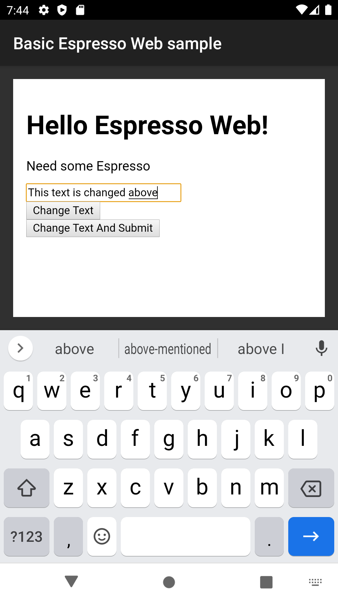
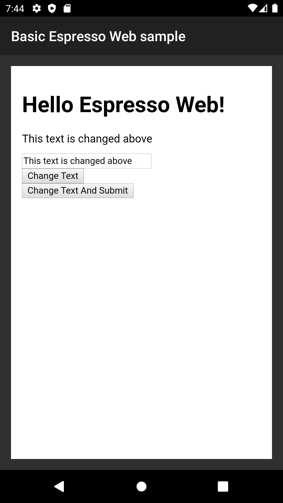
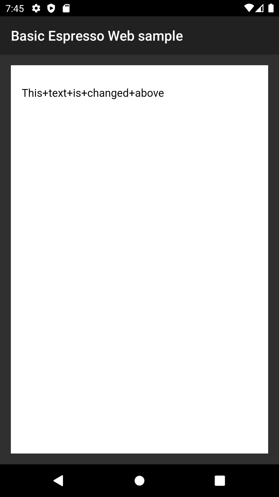
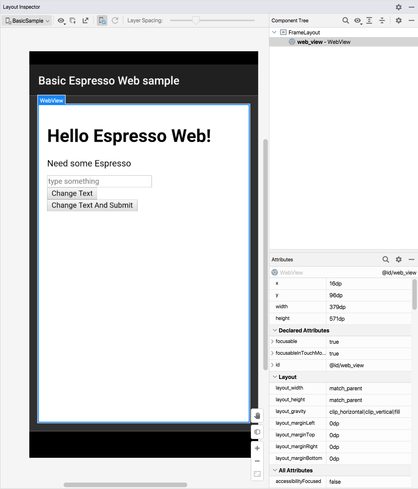
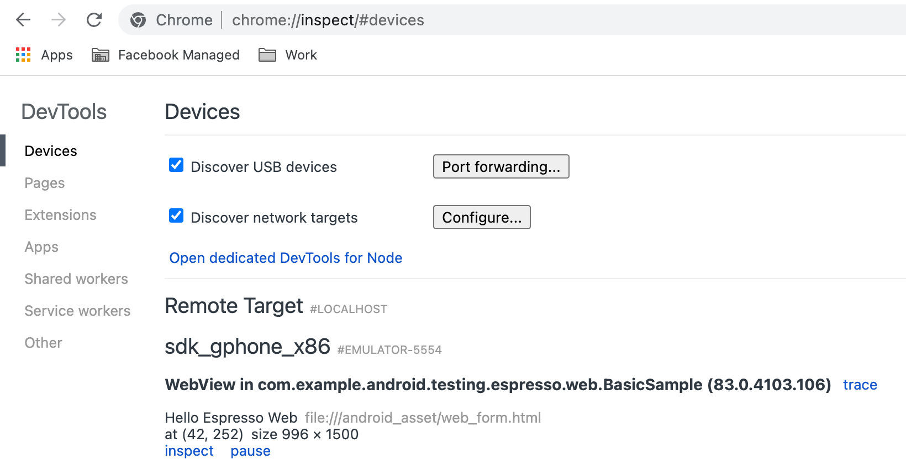
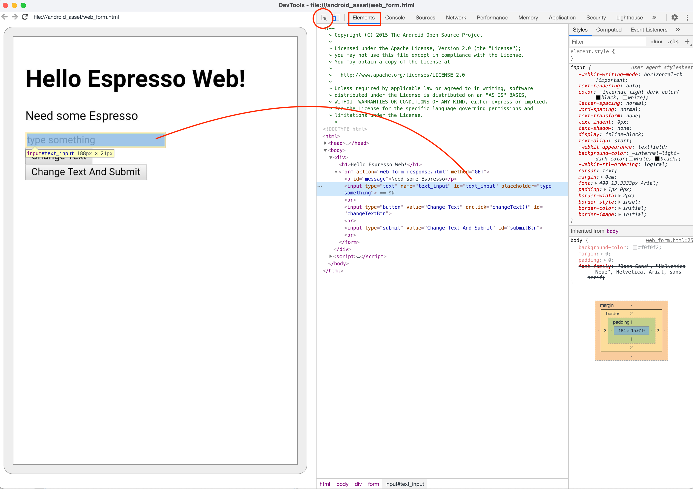
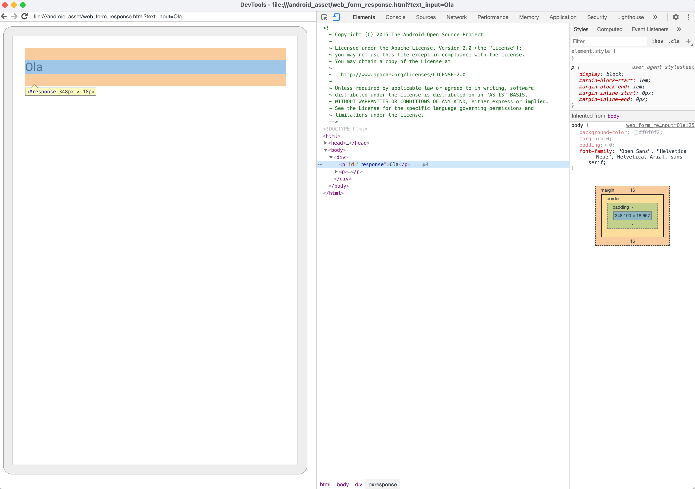

<figure class="image">
    
    <figcaption>
        Espresso logo image by <a
            href="https://www.google.com/imgres?imgurl=https%3A%2F%2Fmiro.medium.com%2Fmax%2F600%2F1*Z2iFvuo4pMsK-aYhPkiGWA.png&imgrefurl=https%3A%2F%2Fproandroiddev.com%2Ftesting-android-ui-with-pleasure-e7d795308821&tbnid=2m9PR31uA1zqGM&vet=12ahUKEwjtm9SLnMT3AhVE8IUKHREuDVUQMygAegUIARCpAQ..i&docid=cWI2R5HvetOtGM&w=600&h=692&q=espresso%20android&ved=2ahUKEwjtm9SLnMT3AhVE8IUKHREuDVUQMygAegUIARCpAQ">Pro Android Dev</a>
    </figcaption>
</figure>

In the last part [Hello, espresso! Part 4 Working with Idling resources
😴](), We
understood how to use **espresso idling resources** to achieve synchronization
when the app is running background tasks that espresso is not aware of. Go ahead
and have a read in case you missed it.

## Automating Hybrid apps with WebViews

Switching gears to a different topic now, many android apps expose certain
business logic in `WebViews` within Native apps. You can think of it as a mobile
browser like chrome/firefox that is able to render web pages.

Its quite important to cover the interaction your native app has with these Web
components to ensure there are no missed regressions in your app releases.

Some common examples when an app might have a WebView are:

- There may be help or support pages for your business that needs to be dynamic
  and change whenever a new page/option is added
- Or pages to host marketing content is launched
- Or even lengthy terms and conditions for a new feature

Having a WebView is great since its much faster to make changes and roll out web
app changes to production and developers are not restricted with Google play
store approvals and roll outs

## What tests to cover and what not? 🤔

Espresso framework provides a library `espresso-web` that provides an "espresso
like" API interface over
[**Selenium WebDriver**](https://www.selenium.dev/documentation/webdriver/) API

### When should you write an espresso web test? ✅

If your app has user journeys between native app and webview, and you want to
make sure these **interactions** work then it surely makes sense to cover this
as part of an Espresso test

### When you should not? ❌

However, if you only want to **verify the `WebView` content or functionality**
without any native interaction checks, then its much better to write an
**automated Web Test** instead using Selenium WebDriver or equivalent library as
that would be much faster and easier to write, maintain and run

## How does this work?

- Espresso web uses a **Javascript bridge** to interact with the WebDriver
  framework and uses
  [**atoms**](https://github.com/SeleniumHQ/selenium/wiki/Automation-Atoms)
- You can consider atoms as equivalent to `ViewMatcher` and `ViewAction` classes
- Espresso web wraps these atoms with `Web` and `Web.WebInteraction` classes
  that makes writing an Espresso web test feel similar to writing a test for a
  native app

we use `findElement()` or `getElement()` methods with certain locators (like
**ID, XPATH, CSS, CLASS NAME** etc) to find an element and then perform an
action or assertion on top of it

## Writing your first Web test

Let's write a test to see this in action

### Adding dependencies

We need to add `espresso-web` to our `app/build.gradle` file

```java
androidTestImplementation 'androidx.test:core:' + rootProject.coreVersion;
androidTestImplementation 'androidx.test.ext:junit:' + rootProject.extJUnitVersion;
androidTestImplementation 'androidx.test:runner:' + rootProject.runnerVersion;
androidTestImplementation 'androidx.test:rules:' + rootProject.rulesVersion;
androidTestImplementation 'androidx.test.espresso:espresso-web:' + rootProject.espressoVersion;
```

And add below library versions in root `build.gradle` file

```java
ext {
    buildToolsVersion = "31.0.0"
    androidxAnnotationVersion = "1.2.0"
    guavaVersion = "30.1.1-android"
    coreVersion = "1.4.1-alpha05"
    extJUnitVersion = "1.1.4-alpha05"
    runnerVersion = "1.5.0-alpha02"
    rulesVersion = "1.4.1-alpha05"
    espressoVersion = "3.5.0-alpha05"
}
```

### Understanding app under test

Let's understand the app flows that we would be automating before we jump into
the code

```text
Feature: Test WebView inside Native app using espresso
Scenario: When user enters text and taps on Change text
  GIVEN the user is on the home page of BasicEspressoWebSample
  WHEN the user enters a text in textbox
  AND the user taps on "Change Text" button
  THEN the label displays the entered test

Scenario: When user enters text and taps on Change text
  GIVEN the user is on the home page of BasicEspressoWebSample
  WHEN the user enters a text in textbox
  AND the user taps on "Change Text And Submit" button
  THEN the web page redirects to another page with a label displaying the entered test
```

Below screens show the app for above scenarios:



Above Figure: WHEN the user enters a text in textbox



Above Figure: AND the user taps on "Change Text" button THEN the label displays
the entered test



Above Figure: THEN the web page redirects to another page with a label
displaying the entered test

### Finding locators using Chrome debug tools

If you try to use the Android studio **"Layout Inspector"**, then you'll be
disappointed to see that it does not show the Component tree like native apps to
enable us to find the desired locator, it only shows the containing WebView



Above Figure: Trying to use layout inspector

So, whats the solution?

We need to use
[Chrome remote debugging tool](https://developer.chrome.com/docs/devtools/remote-debugging/)
to inspect our app.

Follow below steps:

- Connect your device or emulator via USB
- Ensure developer options are enabled
- Verify that USB debugging is enabled and the connected laptop trusts your
  android device

Once done, you can type `chrome://inspect` in your chrome browser tab and this
would open chrome debugging tools like below, Tap on **Inspect** button



Above Figure: Chrome inspect devices screen

Once you tap on inspect it should bring up **Chrome developer tools** window and
you can go to **Elements** tab and then use the inspect button to look at the
HTML/CSS structure of the web page



Above Figure: Chrome dev tools showing the webview and its associated DOM for
home page

Once you enter some text and tap on "Change text and submit" button, you'll see
a screen like below



Above Figure: Chrome dev tools showing the 2nd web page after user taps on
"Change text and Submit"

### Enabling Chrome debugging + JavaScript (JS) Execution on the app

We need to add few lines in our app source code to enable chrome debugging.

Please ensure you add the line:
`WebView.setWebContentsDebuggingEnabled(BuildConfig.DEBUG);` in your
**MainActivity**, this would enable Chrome debug tools to inspect your WebView
only for **debug** versions of the app

This method was also added in **Android Kit kat** thus we need to add an
annotation like `@RequiresApi(api = Build.VERSION_CODES.KITKAT)` to our
`onCreate` method as well

We also add additional logic to enable JS execution

```java
mWebView.getSettings().setJavaScriptEnabled(true);
mWebView.loadUrl(urlFromIntent(getIntent()));
mWebView.requestFocus();
mWebView.setWebViewClient(new WebViewClient() {
    @Override
    public boolean shouldOverrideUrlLoading(WebView view, String url) {
        return false;
    }
});
```

Below you can see the complete `onCreate()` method

```java
// setWebContentsDebuggingEnabled requires KITKAT version+, thus adding @RequiresApi annotation
    // Also suppressing warning about enabling Javascript execution that can cause XSS vulnerabilities
    @SuppressLint("SetJavaScriptEnabled")
    @RequiresApi(api = Build.VERSION_CODES.KITKAT)
    @Override
    protected void onCreate(Bundle savedInstanceState) {
        super.onCreate(savedInstanceState);
        setContentView(R.layout.activity_web_view);
        mWebView = (WebView) findViewById(R.id.web_view);

        // Enables chrome remote debugging:
        // https://stackoverflow.com/questions/21903934/how-to-debug-webview-remotely
        WebView.setWebContentsDebuggingEnabled(BuildConfig.DEBUG);

        mWebView.getSettings().setJavaScriptEnabled(true);
        mWebView.loadUrl(urlFromIntent(getIntent()));
        mWebView.requestFocus();
        mWebView.setWebViewClient(new WebViewClient() {
            @Override
            public boolean shouldOverrideUrlLoading(WebView view, String url) {
                return false;
            }
        });
    }

    private static String urlFromIntent(@NonNull Intent intent) {
        checkNotNull(intent, "Intent cannot be null!");
        String url = intent.getStringExtra(KEY_URL_TO_LOAD);
        return !TextUtils.isEmpty(url) ? url : WEB_FORM_URL;
    }
```

If you are not familiar with how to find **web locators**, search with keywords
"locators xpath" or "locators css" in google and you should be able to find tons
of resources.

Alternatively, You could refer to
[Selenium Tips: Better Locators in Selenium](https://saucelabs.com/blog/selenium-tips-better-locators-in-selenium)
post from Sauce Labs as a starter

### Let's write our test

You can see the complete test below:

```java
package com.example.android.testing.espresso.web.BasicSample;

import static androidx.test.espresso.matcher.ViewMatchers.withId;
import static androidx.test.espresso.web.assertion.WebViewAssertions.webMatches;
import static androidx.test.espresso.web.sugar.Web.onWebView;
import static androidx.test.espresso.web.webdriver.DriverAtoms.clearElement;
import static androidx.test.espresso.web.webdriver.DriverAtoms.findElement;
import static androidx.test.espresso.web.webdriver.DriverAtoms.getText;
import static androidx.test.espresso.web.webdriver.DriverAtoms.webClick;
import static androidx.test.espresso.web.webdriver.DriverAtoms.webKeys;
import static org.hamcrest.Matchers.containsString;

import androidx.test.espresso.web.webdriver.Locator;
import androidx.test.ext.junit.rules.ActivityScenarioRule;
import androidx.test.ext.junit.runners.AndroidJUnit4;

import org.junit.Before;
import org.junit.Rule;
import org.junit.Test;
import org.junit.runner.RunWith;

@RunWith(AndroidJUnit4.class)
public class WebViewPracticeTest {
    // Launch activity with ActivityScenarioRule
    @Rule
    public ActivityScenarioRule<WebViewActivity> mActivityScenarioRule = new ActivityScenarioRule<>(WebViewActivity.class);

    @Before
    public void enableJSOnWebView() {
        // We enable Javascript execution on the webview
        onWebView().forceJavascriptEnabled();
    }

    @Test
    public void whenUserEntersText_AndTapsOnChangeTextAndSubmit_ThenTextIsChangedInANewPage() {
        String text = "Peekaboo";
        // We start our test by finding the WebView we want to work with
        onWebView(withId(R.id.web_view))
                // Find the text box using id
                .withElement(findElement(Locator.ID, "text_input"))
                // Clear any existing text to ensure predictable result
                .perform(clearElement())
                // Type text
                .perform(webKeys(text))
                // Find submit button
                .withElement(findElement(Locator.ID, "submitBtn"))
                // Click on submit button
                .perform(webClick())
                // Find the element where the changed text is displayed
                .withElement(findElement(Locator.ID, "response"))
                // Verify the text for the element has our initially entered text
                .check(webMatches(getText(), containsString(text)));
    }

    /**
     * This test repeats steps as above, it just clicks on change text button and verifies the
     * result text is updated on the same page
     */
    @Test
    public void whenUserEntersText_AndTapsOnChange_ThenTextIsChangedInANewPage() {
        String text = "Peekaboo";
        onWebView(withId(R.id.web_view))
                .withElement(findElement(Locator.ID, "text_input"))
                .perform(clearElement())
                .perform(webKeys(text))
                .withElement(findElement(Locator.ID, "changeTextBtn"))
                .perform(webClick())
                .withElement(findElement(Locator.ID, "message"))
                .check(webMatches(getText(), containsString(text)));
    }
}
```

Let's unpack this and understand in more detail

We start by launching our Activity using `ActivityScenarioRule` and specify it
as a JUnit rule

```java
// Launch activity with ActivityScenarioRule
@Rule
public ActivityScenarioRule<WebViewActivity> mActivityScenarioRule = new ActivityScenarioRule<>(WebViewActivity.class);
```

Since we are using Javascript to drive the browser, we need to enable it on the
WebView, To do so, we'll add a method to run before any test and annotate it
with `@Before`

```java
@Before
public void enableJSOnWebView() {
    // We enable Javascript execution on the webview
    onWebView().forceJavascriptEnabled();
}
```

To start our web test, we first specify the `WebView` we want to work with using
the `onWebView()` method

> If we had a single WebView on the activity then we could skip adding the
> `withId()` method (Here we keep it to be specific), this method returns a
> `WebInteraction` object that exposes the Web API actions to drive our
> `WebView`

```java
// We start our test by finding the WebView we want to work with
onWebView(withId(R.id.web_view))
```

Next, we want to be able to find our text box

- We do so by using `withElement()` method that takes an
  `Atom<ElementReference>` as input to find an element,
- We use `findElement()` that takes first argument as the Locator, followed by
  the actual locator
  - In our test we have an `id` available for these elements by looking in the
    DOM tree in Chrome debug tools, we mention `text_input`

We could use any of the below locators to identify our elements:

```java
CLASS_NAME("className"),
CSS_SELECTOR("css"),
ID("id"),
LINK_TEXT("linkText"),
NAME("name"),
PARTIAL_LINK_TEXT("partialLinkText"),
TAG_NAME("tagName"),
XPATH("xpath");
```

The full statement looks like below:

```java
// Find the text box using id
.withElement(findElement(Locator.ID, "text_input"))
```

We want to make sure we clear any existing text from the text box and type a
desired text, we do so using `clearElement()` and `webKeys(text)` method:

```java
// Clear any existing text to ensure predictable result
.perform(clearElement())
// Type text
.perform(webKeys(text))
```

We then use similar methods to find the button element and perform a click on it

```java
// Find submit button
.withElement(findElement(Locator.ID, "submitBtn"))
// Click on submit button
.perform(webClick())
```

And finally, we check that the label has the desired text that we entered by
adding:

```java
// Find the element where the changed text is displayed
.withElement(findElement(Locator.ID, "response"))
// Verify the text for the element has our initially entered text
.check(webMatches(getText(), containsString(text)));
```

> If you notice, most of the methods have a similar structure to native app
> espresso actions and assertions, most of our methods have "web" prefix, you
> could use this intuition to find the relevant methods using Android studio for
> your specific test cases

We can then easily write the 2nd test using similar commands (see the above)

If we run both these tests, we should see them launch our activity and drive our
`WebView` similar to a native app. Hopefully you understand the general
structure well enough to go ahead and write your own tests.

## Resources 📘

- You can find the app and test code for this post on Github under
  `automationhacks/testing-samples`:
  - [App](https://github.com/automationhacks/testing-samples/tree/main/ui/espresso/WebBasicSample)
  - [Test code](https://github.com/automationhacks/testing-samples/blob/main/ui/espresso/WebBasicSample/app/src/androidTest/java/com/example/android/testing/espresso/web/BasicSample/WebViewPracticeTest.java)
- Please read
  [Espresso Web](https://developer.android.com/training/testing/espresso/web) on
  android developers for some more context

## Conclusion ✅

Hopefully, this post gives you an idea of how to work with `WebViews` in
espresso. Stay tuned for the next post where we’ll dive into how to automate and
work with **WebViews** with espresso

As always, Do share this with your friends or colleagues and if you have
thoughts or feedback, I’d be more than happy to chat over on Twitter or
comments. Until next time. Happy Testing and learning.
