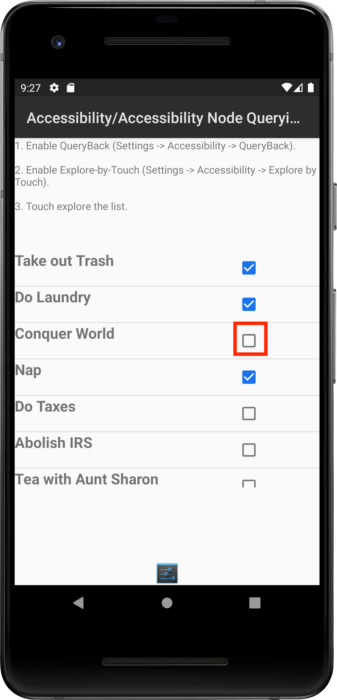
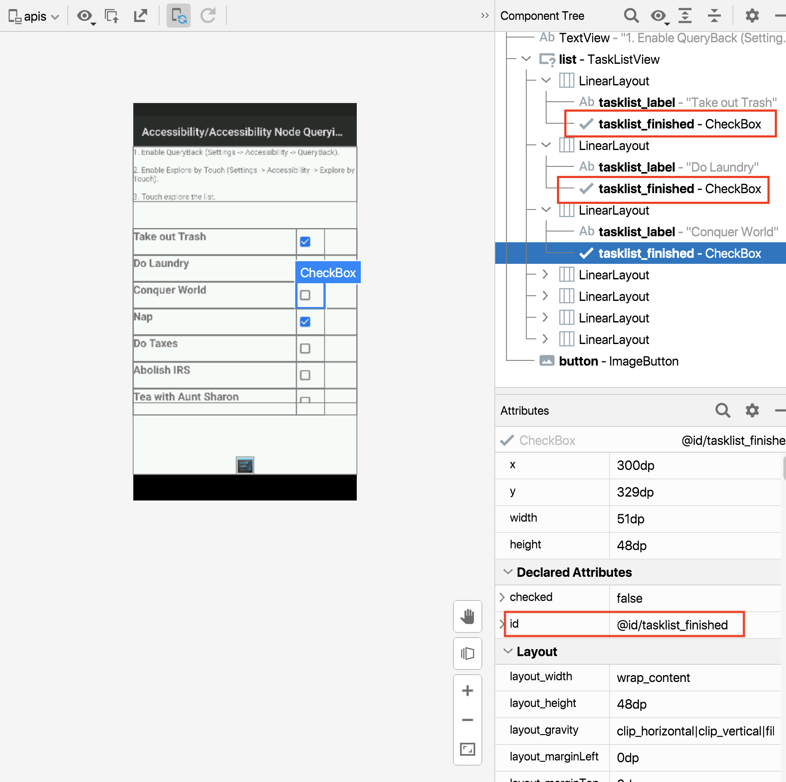

<figure class="image">
    
    <figcaption>
        Espresso logo image by <a
            href="https://www.google.com/imgres?imgurl=https%3A%2F%2Fmiro.medium.com%2Fmax%2F600%2F1*Z2iFvuo4pMsK-aYhPkiGWA.png&imgrefurl=https%3A%2F%2Fproandroiddev.com%2Ftesting-android-ui-with-pleasure-e7d795308821&tbnid=2m9PR31uA1zqGM&vet=12ahUKEwjtm9SLnMT3AhVE8IUKHREuDVUQMygAegUIARCpAQ..i&docid=cWI2R5HvetOtGM&w=600&h=692&q=espresso%20android&ved=2ahUKEwjtm9SLnMT3AhVE8IUKHREuDVUQMygAegUIARCpAQ">Pro Android Dev</a> 
    </figcaption>
</figure>

## Learning outcome

In this post, we will understand how to find an element using its adjacent elements property and `hasSibling` matcher

## Overview

In the last part of our series on espresso [Hello, espresso! Part 5 Automating WebViews
🕸️🌎](), We understood how to automate web
views with espresso. Please go ahead and have a read in case you missed it.

By now, You should have a solid idea on how to automate android UI tests with espresso and be somewhat familiar with its
core API

In the next few posts we'll explore at how to accomplish common scenarios in android apps or recipes

Let's go.

## How to find an element with its sibling

Most modern mobile apps are designed in a modular fashion with reusable components wherein the same component is
duplicated in a list like control.

In some cases there will be multiple elements with similar `ID` and finding them using `R.id.x` would not work since
espresso does not know which specific element we are trying to look up.

In such cases, we can find elements using some unique property of its adjacent (or sibling) element.

Let's take a look at an example to understand how this works in action

## Understanding the App under test

For this test we'll use [`APIDemos` app](https://github.com/automationhacks/android-apidemos) which has been forked from
the popular [Appium](https://appium.io/) project (which itself was forked from a Google repo).

This app showcases lot of Android components as examples and as such is quite a decent playground app.

Say we want to automate below scenario:

```gherkin
GIVEN user opens Task list activity
WHEN user taps on checkbox with id `@id/tasklist_finished` for "Conquer world" item in checklist
THEN checkbox is enabled
```

{: width="300" style="display:block; margin-left:auto;
margin-right:auto"}

> NOTE: If you are manually exploring the app using Android emulator within android studio you can arrive at this screen
> by tapping on **Accessibility > Accessibility Node Querying**

If you try to inspect a unique id for this checkbox, you'll find there are multiple such checkboxes within
`@android:id/list` and we can't use that attribute

{: style="display:block; margin-left:auto;
margin-right:auto"}

However each checkbox has a `TextView` control that has a unique text and we can use this property to identify the
element

## Let's write our test

We launch our activity using:

```java
@Rule
    public ActivityScenarioRule<TaskListActivity> activityScenarioRule =
            new ActivityScenarioRule<>(TaskListActivity.class);
```

Let's use the property that the sibling element has a unique text to find the desired element

```java
String taskText = "Conquer World";
onView(allOf(withId(R.id.tasklist_finished), hasSibling(withText(taskText))))
```

We start by saying:

- We want to find a view that matches all the the properties by wrapping the conditions in `allOf`
- Next we say we want to find an element with id `withId(R.id.tasklist_finished)` (i.e. our checkbox)
- However, we only want the element that has a sibling with specific text by specifying `hasSibling(withText(taskText))`
  that uses `hasSibling` View matcher

Finally once we have found the element, we want to click on it and check that the state changes to checked by
specifying:

```java
.perform(click())
.check(matches(isChecked()));
```

Below is the complete test:

```java
package recipes;

import static androidx.test.espresso.Espresso.onView;
import static androidx.test.espresso.action.ViewActions.click;
import static androidx.test.espresso.assertion.ViewAssertions.matches;
import static androidx.test.espresso.matcher.ViewMatchers.hasSibling;
import static androidx.test.espresso.matcher.ViewMatchers.isChecked;
import static androidx.test.espresso.matcher.ViewMatchers.withId;
import static androidx.test.espresso.matcher.ViewMatchers.withText;
import static org.hamcrest.Matchers.allOf;

import androidx.test.ext.junit.rules.ActivityScenarioRule;
import androidx.test.runner.AndroidJUnit4;

import org.junit.Rule;
import org.junit.Test;
import org.junit.runner.RunWith;

import io.appium.android.apis.R;
import io.appium.android.apis.accessibility.TaskListActivity;

@RunWith(AndroidJUnit4.class)
public class FindElementUsingHasSiblingE2ETest {
    @Rule
    public ActivityScenarioRule<TaskListActivity> activityScenarioRule =
            new ActivityScenarioRule<>(TaskListActivity.class);

    @Test
    public void testCanFindElementUsingSiblingMatcher() {
        String taskText = "Conquer World";
        // Find checkbox with id tasklist_finished that has sibling label with text Conquer World
        onView(allOf(withId(R.id.tasklist_finished), hasSibling(withText(taskText))))
                // Click on the checkbox
                .perform(click())
                // Verify the checkbox was ticked
                .check(matches(isChecked()));
    }
}
```

## Resources 📘

- [App code](https://github.com/automationhacks/android-apidemos/blob/master/app/src/main/java/io/appium/android/apis/accessibility/TaskListActivity.java)
- [Test code](https://github.com/automationhacks/android-apidemos/blob/master/app/src/androidTest/java/recipes/FindElementUsingHasSiblingE2ETest.java)
- Read [Espresso recipes](https://developer.android.com/training/testing/espresso/recipes#matching-view-next-to-view)

## Before you go

Thanks for spending your time reading this post. 🙏

💡 If you found this insightful or helpful 👍🏼, then please take a few minutes and share it with your friends and
colleagues or on your social media accounts. Every share helps this grow and **"sharing is caring"** 🫂 isn't it?

Before you go 🙌🏼. Did you know?

- I publish a newsletter ✉️, **Subscribe** to 👉 [newsletter.automationhacks.io](https://newsletter.automationhacks.io/)
  to get this in your email inbox
- And, also recently started a YouTube channel 📺, **Subscribe** to 👉
  [automation hacks](https://www.youtube.com/channel/UC-KAka-3EgsbF1kekh_uYJw/featured) to not miss out when a new video
  is out.

I go deep into **Test Automation** and **Software Testing** in both these platforms as well and you may find subscribing
valuable to your learning journey

Have Questions 🤔 or Feedback 😉?

Please let me know in the comments (I promise I read them all ✌🏼) or you can ping me over Twitter or LinkedIn at
`@automationhacks`

Until next time, Happy Testing 🕵🏻 and Learning! 🌱