<figure class="image">
    
    <figcaption>Agent and MCP ecosystem in 2025</figcaption>
</figure>

We’ll use GitHub Copilot Agent mode to build a developer productivity feature for analyzing failing test stack traces and grasp the nuances as we vibe code our way

Github Copilot recently [announced](https://github.blog/news-insights/product-news/github-copilot-the-agent-awakens/) the general availability of **Agent mode**

Agentic AI, Agents, and MCP (Model context protocol) have been buzzwords that have filled much of the Internet and social media chatter in the past few months. Among all the hype about its capabilities, it’s hard to separate noise from signal.

In this blog, I’ll explain these technologies and how we can use them practically in our day-to-day software engineering workflow in simple, non-marketing language for real software engineers.

Let’s dive right in. 🥽

## Agent mode for beginners 🤔

The usage aspect of Agent mode is similar to Edits or chat.

You **specify a [prompt](https://www.educative.io/courses/all-you-need-to-know-about-prompt-engineering?aff=x4QL)** and let the [LLM](https://www.educative.io/courses/essentials-of-large-language-models-a-beginners-journey?aff=x4QL) do its thing, but let’s take a deeper look at these different terms, concepts, and capabilities that this new mode brings and try to form a good mental model

### What is Agent mode?

And how is this different from [GitHub Copilot Edits](https://newsletter.automationhacks.io/p/copilot-edits-edit-multiple-files) or [Copilot chat](https://newsletter.automationhacks.io/p/ai-for-testing-2-code-assistance-inline-chat-and-chat-commands)?

All perfectly valid questions.

**Agent mode** can be thought of as a more powerful version of Copilot Edits that:

* Can use **tools**to achieve tasks that require more planning
* Understand and reference multiple files in your codebase without having to specify them manually
* Create and run tests with your permission
* Running commands on the terminal

It does this while putting the developer in control to review and approve different stages, such as which tools to use, accept, or reject changes, etc.

Tools here can be thought of as a function that exposes some capability from an **Application, CLI, API, or data source.** They can be used to achieve a certain task by leveraging the **[model context protocol (MCP)](https://modelcontextprotocol.io/introduction)**. A simple example could be reading a file and writing a file in your own codebase.

### What is MCP?

A couple of helpful analogies that I find helpful when thinking about MCP

1. MCP is like the **USB-C port for AI**applications
2. It supports a more **plug-and-play** way of working with AI, wherein you or Agent can add a relevant MCP server to make it easier for your AI model to talk to and leverage its capabilities to complete a certain task

MCP also helps **reduce hallucination problems to a certain degree** for [LLMs (Large language models)](https://www.educative.io/courses/essentials-of-large-language-models-a-beginners-journey?aff=x4QL), as they now provide a more deterministic and efficient way to work with different **tools** and **resources**

The community has already picked up this idea and started producing a bunch of [MCP servers](https://github.com/punkpeye/awesome-mcp-servers) for different existing applications to support LLM-driven development, [along with OpenAI](https://community.openai.com/t/preparing-for-mcp-in-responses/1152972)

What does a [MCP](https://modelcontextprotocol.io/introduction) server look like in practice, and should you care?

For the most part, discovering relevant tools and MCP is something that Agent mode itself may take care however, if you are deeply engrossed in the domain and know that what you are trying to build would require a certain specific MCP server, you could also add those while initiating the session

You can refer to the [GitHub MCP server](https://github.com/github/github-mcp-server?tab=readme-ov-file) README to understand what GitHub functionality is exposed.

In practice, it looks like a function wherein the parameters are specified with their data type, and whether a field is **required/optional**

* `get_issue - Gets the contents of an issue within a repository`
  * `owner: Repository owner (string, required)`
  * `repo: Repository name (string, required)`
  * `issue_number: Issue number (number, required)`
* `get_issue_comments - Get comments for a GitHub issue`
  * `owner: Repository owner (string, required)`
  * `repo: Repository name (string, required)`
  * `issue_number: Issue number (number, required)`

We can do a deeper dive in MCP later, but for now, this basic intuition is good enough.

What would a workflow look like with Agent mode as a developer?

1. **Prompt:** Come up with an **idea** and a **detailed prompt** for what you want to achieve. – It could be an enhancement of an existing feature to add a new capability, add test coverage for a particular area, etc
2. **Server:** Add relevant MCP servers that provide said capabilities, or let Agent mode autodiscover it. – For example, if you are building a CI/CD feature, and you want to leverage the underlying CI tool, you can add an MCP server for that tool, like Jenkins, GitHub Actions, etc
3. **Instructions:** Add relevant instructions in a `custom_instructions.md` file to highlight **rules**, for example. You can say *add a changelog of every change that you made to keep track of what the last change* made by Agent mode was.
4. **Execution:** Let Agent mode go off and execute on your idea, review the suggestions for accuracy, and only merge changes that make sense.
5. **Fine-tuning:** Take control back and edit or refactor the code further before shipping it.

## An actual pairing session with Copilot Agent mode

I paired with Copilot Agent mode to build a feature that was in my mind for some time.

Let’s go through the steps and, in the proces,s understand different nuances

When you launch the Agent mode window for the first time on VS Code, you’ll see a welcome message that gives you a hint about how to leverage its capabilities

You can:

1. Attach context using `hash #`
2. `at the rate @`to chat with extensions
3. Use a `forward slash (/)`to use commands


Let’s ask Copilot Agent mode to build a feature in the [test-infra](https://github.com/automationhacks/test-infra) codebase.

You can follow different changes that were created by Agent mode and my pairing in tandem in the branch [failure_auto_fixes](https://github.com/automationhacks/test-infra/tree/failure_auto_fixes)

### Initial prompt and setup  ⌨️

Let’s set up a session

We’ll copy and paste the below prompt in the chat window

```text
As a Java programmer, I want you to implement a developer productivity feature.

I want you to be able to connect to the report portal instance running on localhost:8080 on this machine and figure out the reason for a failing test from the stack trace, and then suggest a fix for this in the tests under `src/test/java/io/automationhacks/testinfra/reqres` package. 

This should be built in a scalable manner such that this auto-analysis can run on every test suite run or at a scheduled time.

The report portal has an MCP server here:
https://github.com/reportportal/reportportal-mcp-server

API docs can be found here
https://developers.reportportal.io/api-docs/service-api/get-test-items
```

And select **Agent** from the drop-down to indicate you want to use **Agent mode**

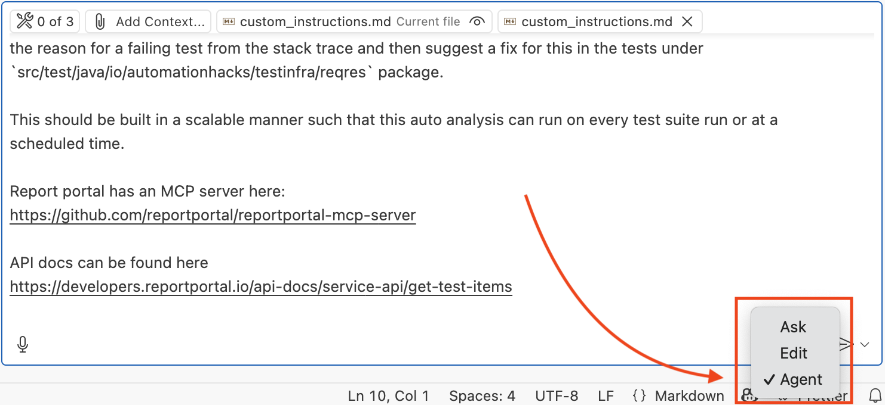

I additionally want Copilot to have a set of rules while working on the problem.

I created a <code>[custom_instructions.md](https://github.com/automationhacks/test-infra/blob/failure_auto_fixes/custom_instructions.md)</code> file and attached it to the context

```markdown
# Instructions

## Rules

- After making a change, update the ai_changes/changelog.md file with what change was made with a timestamp to make it easy to follow
- Keep the code clean, modular, and extensible for future changes
- Prepare a plan before executing and document that in a ai_changes/plan.md file. Also, capture the prompt that was provided by the developer to trigger that change
- Don't hallucinate or make up stuff.
- Always check your work before completing the task
```

### 📃 Planning

Copilot Agent mode first breaks the problem down into:

1. Requirements
2. Research and setup
3. Created an implementation plan
4. Dove into implementing this plan.

During this process, tools were also used to check if the file exists in the codebase.

Wherever details are not provided in the prompt, it will proceed to make reasonable assumptions

You’ll also notice the Agent mode periodically prompts you as the user to decide if the direction in which it is proceeding is making sense or not.

You can decide to pause and refine your prompts or give additional instructions to nudge it in a particular direction, or let it continue.

You can review changes made at each phase by clicking on the file and seeing how many lines were added or removed. For exampl,e **ReportPortalClient.java +69 -1**indicates 69 lines added and 1 removed

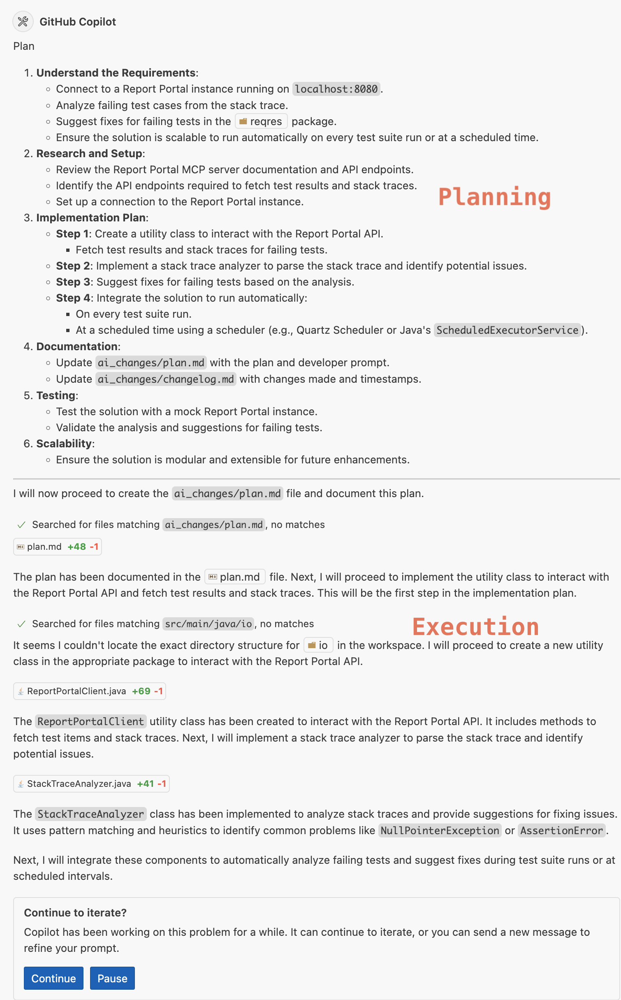

### 🛠️ Checking and fixing compilation issues

For this problem, Copilot identified the correct components, so I just let it continue onwards

It did a couple of interesting things in this phase

1. It reads existing files to determine if the required libraries are present
2. After finishing the initial implementation, it also checks the written code to verify if there were any problems. If it detects a compilation error, it makes fixes and repeats this till the code compilation or building works fine.

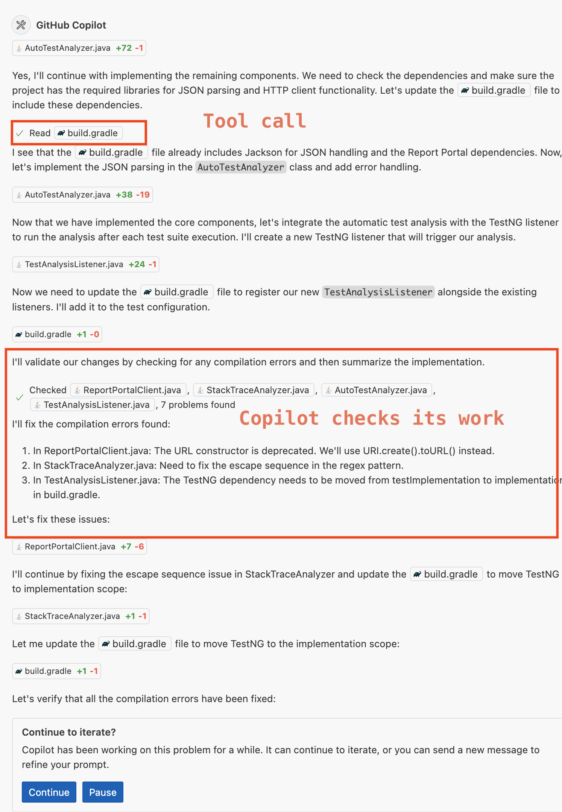

### 📈 Drives improvements

It’s already impressive that it could reach this stage without any user intervention, so I let it continue onwards.

Here, Copilot makes additional improvements by centralizing config management with a properties file and a utility class to provide getters. This is usually a good idea and something I would have done at this stage as well. It again did a round of checks and summarized all the changes it made.


### 🧪 Testing

Now was the moment of truth; things looked good on a high level. I asked it to run the tests and see if the solution works.

```text
Please follow the readme instructions to run all regression tests on the terminal and validate if the above solution works, to suggest fixes when a test fails
```

Copilot prompted me to run a gradle command to run the tests 🤩

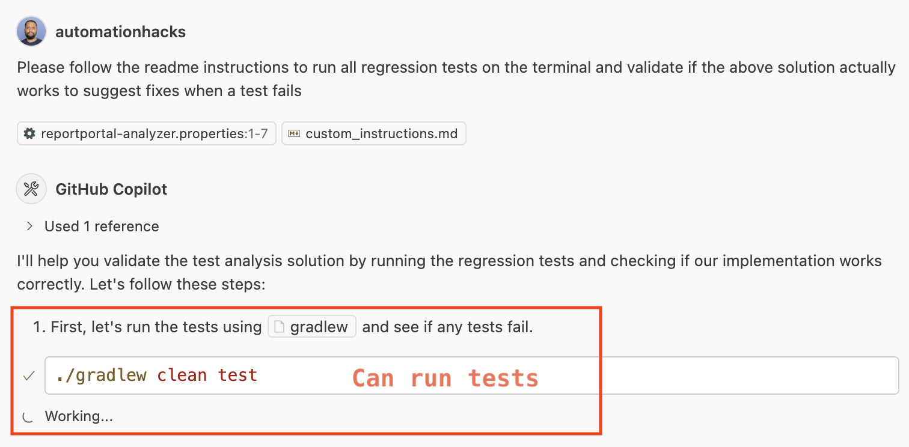

Sadly, most of the tests failed, and also the implemented code did not work for checking stack trace failures in ReportPortal 🤔

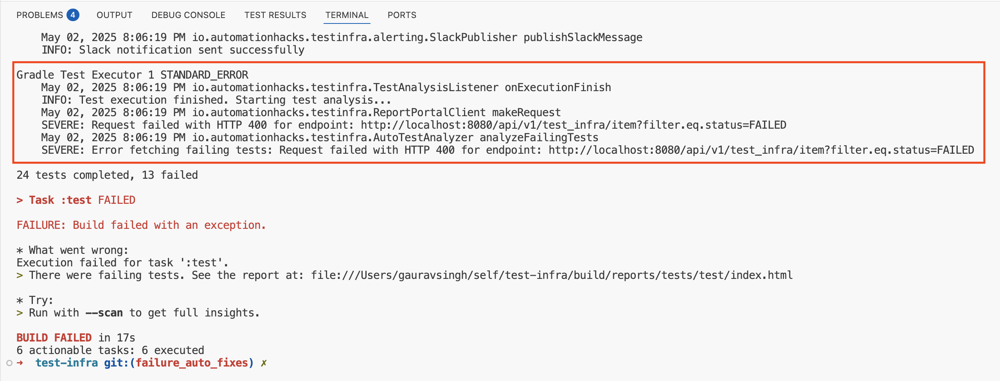

### 🤿 Debugging

Copilot, like any good junior engineer, started breaking down the failures in the logs and tried to come up with the next steps

It correctly identified that:

1. ReqRes tests failed due to 401 errors
2. ReportPortal client failed due to 400

It correctly spotted that the project name was not updated correctly in its created properties file and modified it, ran tests again

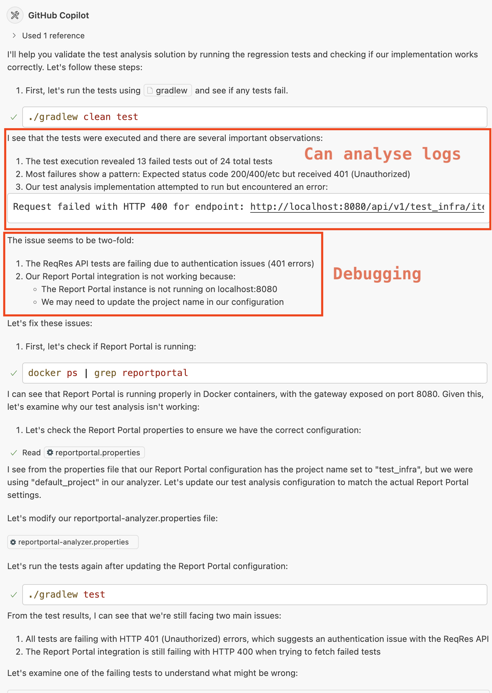

### A bunch of wrong turns

At this time, Copilot made many unnecessary changes to the test files, such as:

1. Removing ReportPortal annotation code that was required.
2. Modifying the team names to something else

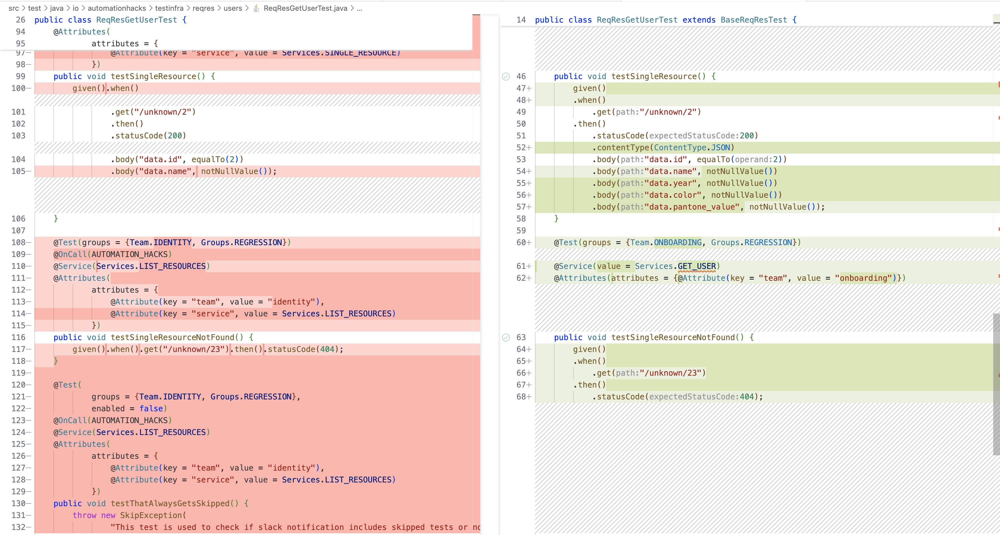

It also hallucinated certain values that were not present in the enum constants, leading to build failures

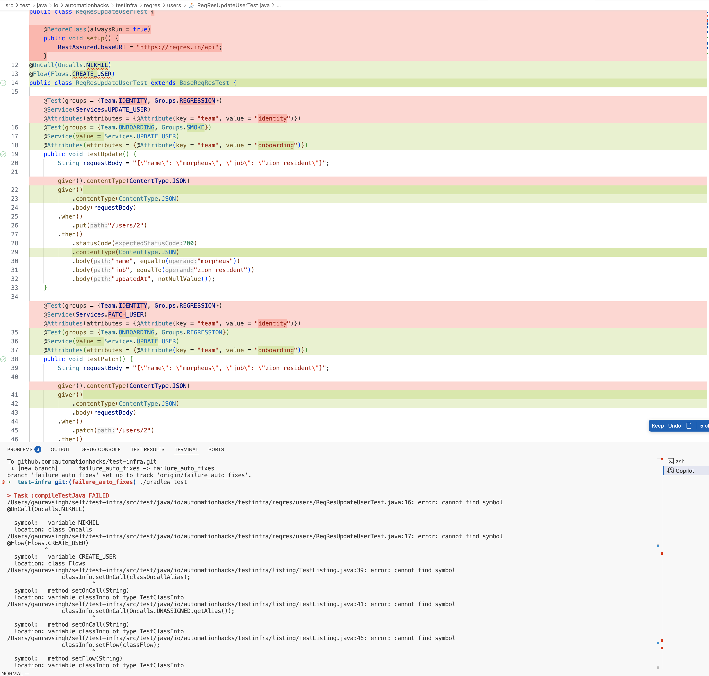

I discarded these changes since they did not make sense

### 🧑🏻‍💻 Enter a human software engineer

I went a couple of rounds with this flow before realizing that Copilot is not able to figure out the real issue. I visited the ReqRes site and saw that they had introduced a new API key header with a rate limit of 100 requests per day. No wonder the tests were broken due to 401


I tested one method after adding the header and then provided this context to Copilot to do further refactoring for me.

```text
Looks like the reason why ReqRes tests were failing were because the site has introduced an API key on their site. I requested one and added it to testRegisterSuccessful. Could you apply this change to other tests and run them to verify the 1st issue is resolved and then focus on the 2nd part of the problem wherein report portal API returns us a 4XX error
```


I continued with the cycle multiple times, and it took some time for Agent mode to correctly refactor all the tests to add the new header.

But … ✋

The core issue of being able to pull a stack trace for a failing test remained.

Agent mode was not able to figure out the correct API sequence to fetch stack traces for failed tests.

I wasted **close to 40-45 minutes trying to get it to [“vibe code”](https://en.wikipedia.org/wiki/Vibe_coding) the solution out as the cool kids suggest**, after which I decided to explore the API docs for ReportPortal myself.

It turned out Copilot was close but not all the way, it was hallucinating some query params for the API that is able to fetch the failed results. I explored the Report portal UI and then, using Chrome developer tools, analyzed XHR requests to figure out the correct APIs that the application uses to display failed tests and their stack traces.

I then played around with the APIs in Postman and identified a sequence of steps that should work, and [wrote it in a markdown file](https://github.com/automationhacks/test-infra/blob/failure_auto_fixes/prompts/report-portal-get-failed-stack-traces.md) to provide as context

Agent mode was now able to modify the ReportPortalClient inline with provided APIs while also being able to figure out why the other tests were failing (due to API key being set in query params instead of header 🤦).

You can find the changes in [this commit](https://github.com/automationhacks/test-infra/commit/09bd9c60aa8ccd4cccd87b8d50eed0ad19a28712)

### ⛔ Build failure again

Copilot modified a method in ReportPortalClient but did not update all the code references, leading to build failures.

Also, I noticed it kept on running all the tests in the workspace when we could only run one sample test to validate the flow.

I prompted it to only run the one case, and it did understand that the build was failing. However, it went on to make a bunch of nonsensical changes, leading to unimported packages, etc, again.

At this point, I realised. It was time to take a pause and jump into this problem and solve it the right way.

I fired up my trusty IntelliJ and started digging into the problem one by one.

I was able to fix the build failure quite easily and realised an earlier implementation was not required since we were already preparing a list of failed test items.

Below is the commit log and the commits that I made to fix the build problems. It’s funny, but as a developer, coding the solution yourself helps you understand it deeply and grasp its structure much better. When you are reviewing code, you tend to prefer speed over quality at each step, and also do not have a good mental model of classes, methods, and their relationship

```markdown
- Update AutoTestAnalyzer to get list of failed test items directly and not query JsonNode
- Fixed a bug wherein `/api/v1` was being added unnecessarily
- Fixed ReportPortalClient urls
- Added a failing tag to run a targeted test
```

[Commit 1](https://github.com/automationhacks/test-infra/commit/4bccbbd146d8db9885c33193756c2a90a07b72fd)

```markdown
- Add model classes for Report Portal test item response and refactor AutoTestAnalyzer to utilize new structure
- Pull stack trace from failing tests description itself
- Updated loggers to log requests
```

[Commit 2](https://github.com/automationhacks/test-infra/commit/b0f920567e1cfcc0156aac77bc867e90e3abfa52)

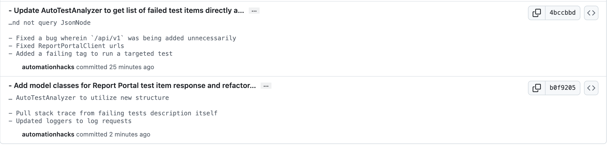

I ran the failing test and saw that I could finish the loop till the point where I was able to identify a failing test, and then the analyzer returned a result

```zsh
May 04, 2025 9:56:00 PM io.automationhacks.testinfra.TestAnalysisListener onExecutionFinish
INFO: Test execution finished. Starting test analysis...
May 04, 2025 9:56:00 PM io.automationhacks.testinfra.AutoTestAnalyzer analyzeFailingTests
INFO: Fetching failing tests from Report Portal...
May 04, 2025 9:56:00 PM io.automationhacks.testinfra.AutoTestAnalyzer analyzeFailingTests
INFO: Found 1 failing tests. Analyzing stack traces for suggestions...
May 04, 2025 9:56:00 PM io.automationhacks.testinfra.AutoTestAnalyzer logAnalysisResult
INFO: Test Item ID: 884
Suggestion: Assertion failed: 1 expectation failed.. Review the assertion conditions.
```

### LLM-based test analyzer

At this point, I felt confident that the flow would work to hand back control to Agent mode.

```markdown
I have made changes in ReportPortalClient and AutoTestAnalyzer to be able to pull the error stack trace. I want you to now focus on StackTraceAnalyzer such that it can detect a failure pattern and then provide a suggestion via an LLM or an Agent mode
```

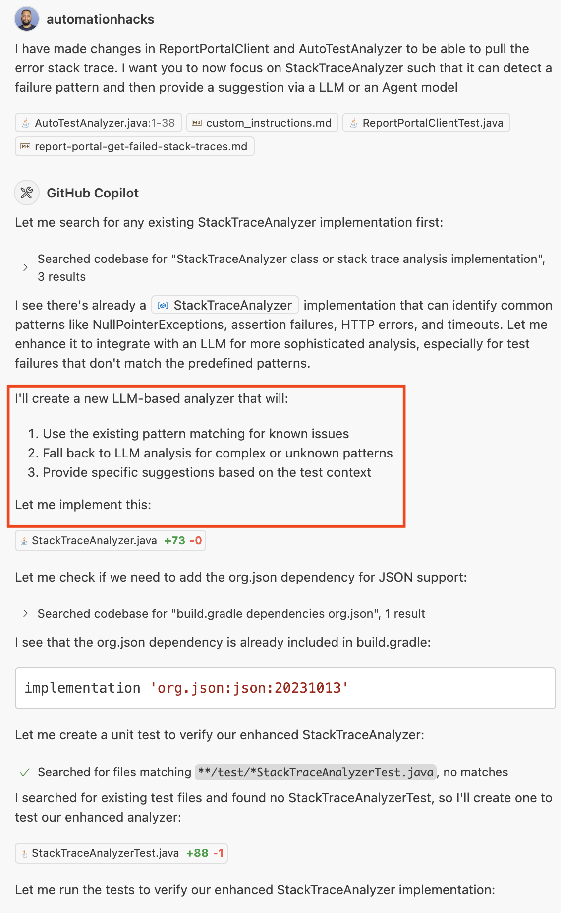

I could now see that Agent mode smartly did manual analysis on a failing test and then added a fallback using an LLM call to OpenAI GPT 3.5. It also went ahead and added tests for the analyzer.

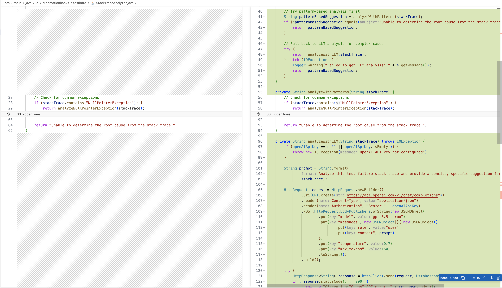

To be honest, this feature seems quite close to completion, and if I were to continue down the path. I feel like this could be added as an operational feature in ReportPortal for teams, of course, after the code is cleaned up and polished.

You could follow all the commits on [GitHub](https://github.com/automationhacks/test-infra/commit/f4f3ceac2d2733387578d781be36dfbf01940ed2) on GitHub

## Conclusion

I hope this practical example gives you a sense of what working with GitHub Copilot Agent mode looks like in actual practice

Here are my top key takeaways

1. **Powerful:** Agent mode is a powerful coding tool and can write code pretty fast for more complex problems and leverage tools (terminal, code search, external MCP servers) to write powerful solutions
2. **Verify:** It sometimes goes down wrong paths and makes nonsensical changes. As a developer, you should take your time and review each change. **Don’t vibe code**further if you don’t understand what’s going on
3. **Learn:** Knowing programming languages, frameworks deeply would help to separate good code from bad. Building taste requires time and practice.
4. **Write code yourself:** Sometimes, it's okay to take on the driver mode, pause the AI Agent, and write the code yourself. It may be faster and easier for you to maintain the code later on
5. **Quality:** Code quality produced by Agent mode is more like an eager early-career engineer. It lacks polish, but that could be fixed by adding in some Senior engineer intuition and more descriptive [prompts](https://www.educative.io/courses/all-you-need-to-know-about-prompt-engineering?aff=x4QL)
6. **Not omnipotent:** AI is not god, it does not know what it does not know. You have to hold it a little bit and provide the right context, prompts, and  knowledge to achieve its tasks
7. **Testing:** Tests tend to be more unit test-like; you should consider writing functional tests for the code it produces as well

Overall, it's an impressive new shiny tool in your toolkit as a professional Software engineer, and you should use it, but with caution ⚠️ Mix it with your experience and intuition, and you can achieve impressive things.

## References

1. [Vibe coding with GitHub Copilot: Agent mode and MCP support rolling out to all VS Code users - The GitHub Blog](https://github.blog/news-insights/product-news/github-copilot-agent-mode-activated/)
2. [Model Context Protocol](https://modelcontextprotocol.io/introduction)
3. [Use MCP servers in VS Code (Preview)](https://code.visualstudio.com/docs/copilot/chat/mcp-servers)

Enjoyed reading this?

Subscribe to the [newsletter](https://newsletter.automationhacks.io/) and [YouTube channel (@automationhacks)](https://www.youtube.com/@automationhacks) for more insights ⚡ into **software testing** and **automation,** or connect on [topmate](https://topmate.io/automationhacks/) for a personalized 1:1 session.

*Disclosure: I’ll earn a small commission if you decide to purchase some of the educative.io text courses linked in the blog for your learning and growth. Their [system design courses](https://www.educative.io/courses/grokking-the-system-design-interview?aff=x4QL)* and *[grokking coding interview](https://www.educative.io/courses/grokking-coding-interview?aff=x4QL) courses are arguably quite helpful for interview prep*.

Until next time, happy testing!
