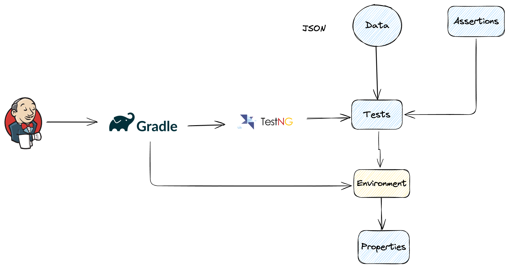
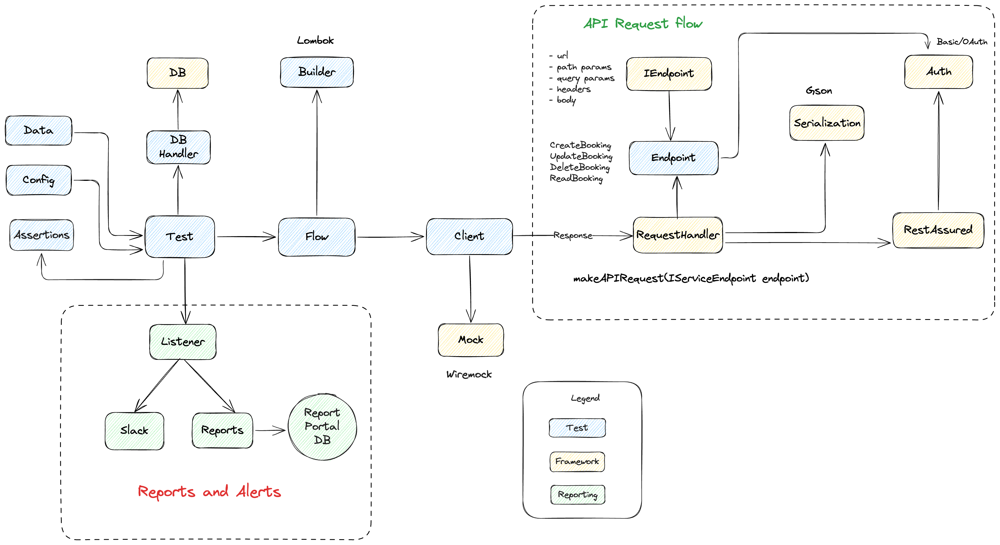

<figure class="image">
    
    <figcaption>Type of interviews for a Software Engineering role</figcaption>
</figure>

I recently completed full interview loops at multiple companies, including startups, product, and Big Tech.

I was targeting 2 major role archetypes.

1. Engineering manager - QA role expected to support a team of 6 - 12 QA engineers or SDETs
2. Senior IC (Individual contributor) or Tech lead roles focused on engineering productivity.

In this blog, I’ll share my personal experience navigating these interview loops,

If you or a friend is looking for similar opportunities, this blog should provide a good mental model on what kind of interview rounds exist and how you can orient yourself to perform well in these interviews.

Let’s go 🏃

## Why target both IC and EM roles? 🤾

You may wonder why I didn't focus on just one role.

The reason is quite simple for me.

I enjoy hands-on work that delves deep into technologies, and I also love working with and mentoring people, often preferring roles that push the boundaries.

I’ve played three major variations of these roles in the past five years.

1. Hands-on Engineering Manager (EM) at **Gojek**
2. Senior IC focused on building test infrastructure and frameworks in a complex technology landscape at **Meta.**
3. Principal IC supporting a group of engineers at **CRED**

And I enjoyed both aspects quite well.

If you personally have a strong inclination for either IC or EM roles, it's fine to only target such roles and companies. It would also make the decision process smoother for you later on, as you can avoid doing an Apple 🍎 to Oranges 🍊comparison.

## What are the major interview types? 🤔

I’ve mainly seen the following types of rounds.

We’ll divide it into 3 main types of conversations – Technical, Behavioural, and Recruiter, each with its focus and expectations.

* **Technical**: The main questions that this loop tries to answer are: Are you a fit technically for this role? Can you raise the engineering bar from your skills, past experiences, and attitude
* **Behavioral:**Do you have the right attitude, and how do you work on all the nontechnical stuff – communication, collaboration, conflict resolution
* **Recruiter:**Initially, to identify if you are in the ballpark vicinity of someone who can do this job, and how much it would cost the company.

Let’s form a high-level intuition first before going deeper.

**Introductory call**

A short **30m - 45m** call with the hiring manager or recruiter to align on a high level if the role seems like a mutual fit

**Technical rounds (45m to 1h 30m)**

Here few rounds are unique to Big Tech companies vs startups/product companies.

**Big Tech**

* **[Coding rounds](https://www.educative.io/courses/grokking-coding-interview?aff=x4QL)**: focused on problem solving on an algorithmic or data structures problem, and your communication skills as you work through them.
* **[System design](https://www.educative.io/courses/grokking-the-system-design-interview?aff=x4QL)**– design a large-scale distributed system or a core engineering system like log processing, build tools, etc.

**Startups and product**

* **Take-home assignment**: Build an automation framework on either API, web, or mobile, based on your preference, and using open-source tools and libraries.
* **Technical discussion** on **framework design and tradeoffs**: if company does take home assignments, you’ll have to explain your design choices and answer follow up questions or if is the first round, this could be a problem statement given on the spot targeting API, Web or Mobile use case, and you’ll have to explain the framework design by breaking down components

**Common**

* **Testing acumen:**Given a problem, application, or system, how would you test its different aspects, what cases can you think of, and what approach would you follow
* **Domain knowledge** round to focus on:
    1. CI/CD, Cloud, Testing tooling, or frameworks
    2. The domain the role expects knowledge over, for example: mocking, stubbing, integration testing, load testing, and their related tooling.

**Behavioral (45m to 1h)**

* **Your experience, projects, or resume walkthrough**: such interviews focus on what you’ve written in your resume and check, for instance, the challenges you've solved, how you handled conflict, did negotiation, what process improvements you created, etc
* **Discussion with a cross-functional partner** (product or developer) to evaluate how you collaborate and get work done across teams and functions (like dev, PM, business, sales, marketing, compliance, legal, etc, to name a few)
* **Behavioral interviews** focusing on **team/stakeholder management**, leadership, and how you handle different situations at work
* Hiring manager interview
* **Recruiter discussion**

Let’s break these different rounds down in more detail so that you have a better idea of each phase.

I’ll also provide some strategies on how you could prepare well and ace these.

## Resume and referral

Before we get into the actual interview rounds, let’s briefly pay our respects to the most important first step …

Creating the opportunity.

### Get a referral and thank me later 🤝

Any good interview loop usually starts with:

1. Searching for relevant openings you are interested in
2. Finding out if you have a mutual connection from your network
3. Preparing a resume tailored to this role
4. Getting a referral
5. Hopefully 🤞🏼a recruiter shortlists your resume if they see a strong fit.

Each of these steps requires patience, good writing, and timely, respectful follow-ups.

> ⚡Tip: Please **leverage your network on social media** to get a referral from someone who works at the company. I’ll do a deep dive on how to create opportunities for yourself in a future blog, as it has more nuance.

Why index heavily on referral?

Your chances increase manyfold if:

* An existing employee can refer and vouch for your skills.
* They can also advocate for you internally and help oil the communication rails between the hiring manager and the recruiter. I’ve personally observed how many times a friend has helped grease internal processes to help move the process forward, leading to better outcomes for me.

If you don’t have a trusted colleague or friend in the company you want to apply for, don’t sweat it; you can use the strategies below.

1. Cold Linked message or email someone you are connected with, but don’t know personally
2. If you find a mutual connection, then ask your connection to introduce you to them and help connect.

It’s fair that not everyone is open to referring a stranger on the internet, when someone declines or does not respond; don’t take it to heart, move on to other options.

Remember to follow up, your referrer has their workload and life to manage, and referring to you may not be on the top of their priority list; reminding them periodically could go a long way.

Again, I really cannot stress enough how **building a strong network** from your past companies, communities, and being **active on platforms like LinkedIn, X**, or **teaching** others could help you build an organic network in the long run.

More on this later in a future blog. I promise. 🤞🏼

### Write a sharp resume

Having a neat, sharply written resume that puts your **past contributions, impact, **and** skills**in the best light is critical.

Luckily, you can leverage your friendly LLM to help with improving the structure and presentation.

> 🚨*Please be careful **not to add made-up numbers** that are not grounded in reality, as it can be a real eyesore for an experienced engineer/manager and they can easily smoke this out on their bullshit meter. Be honest and transparent. Do not lie to get the job. You are not doing anybody any favors with this approach.*

I can recommend [The Google Resume by Gayle Laakmann](https://www.amazon.in/Google-Resume-Gayle-Laakmann-Mcdowell/dp/8126538058)McDowell for tips on a well-written resume.

Once you have your first draft, make sure to get it reviewed by a trusted peer or friend to give you feedback.

You’ll likely have blind spots or biases, and a peer review is usually very helpful to catch those ahead of time.

## Introductory call 📱

Most companies start their loop with an introductory call with a hiring manager or recruiter.

They have taken a look at your resume already and want to evaluate a few things.

1. Are you genuinely interested in the role?
2. How strong of a fit are you for the role in terms of skills?
3. Are you within their budget?

They will usually give you an overview of the role, the team you’ll be working with, the company setup, and the expectations.

Generally, they will ask you to **“Tell me about yourself … “**and take it from there.

As a candidate, it's a good practice to have a **clear outline of your major contributions in the past 3 companies** in a short 3 - 5 min intro. You should make it practical and mention points where there is a strong overlap with your demonstrated contribution/experience and the role you are applying for.

If this is an EM role, try to highlight contributions where you led a team, mentored a group of engineers, led a project E2E, or conducted hiring/performance reviews, etc.

If an IC role, highlight technical contributions you are most proud of, mentoring, and leadership without influence.

Asking an LLM to analyse a job description and your resume to find this out is a helpful preparation exercise.

The prompt could be something like

```markdown
*As an experienced recruiter, please find below the resume [file name] and job description text. Help me identify how closely my resume fits this role? *


*What are the 5 key areas where there is a strong fit and 5 areas with zero to no overlap? *


*Help me frame a short, 200-word, concise, bulleted introduction that can be used to answer the “Tell me about yourself” question in compelling language.*
```

> 🛑 Before asking the LLM, I’ll also encourage you to **do this exercise yourself first** and leverage your brain, because once the LLM gives you the data, you will already be biased.

Remember: You are going to be in the interview, not your LLM

## Technical rounds 🧑‍💻

You can expect different types of technical rounds

### Coding 🧑‍💻

BigTech companies and many high-growth scale-ups or product companies have 1-2 [coding rounds](https://www.educative.io/courses/grokking-coding-interview?aff=x4QL) focused on solving 1-2 Leetcode-style problems within 45 mins. I had [previously written](https://automationhacks.io/2022/01/02/how-i-got-that-job-at-meta#step-4-coding-interview-screening-and-onsite) about this when I was preparing for my meta interview, and I would still recommend this.

Additionally, I found that instead of randomly solving problems. Focusing on Leetcode's top[150](https://leetcode.com/studyplan/top-interview-150/) gives you good, rounded practice.

Practice daily to ensure you are hands-on and can talk out loud while solving the problem.

### [System design](https://www.educative.io/courses/grokking-the-system-design-interview?aff=x4QL) 🌀

If this role is in a BigTech or high-growth product company, you could expect the interviewer may ask you to design a large-scale distributed system.

You can [read this section](https://automationhacks.io/2022/01/02/how-i-got-that-job-at-meta#step-5-system-design-interview) of the blog that I wrote on this topic.

An additional good resource that I’ll recommend is the [Hello Interview](https://www.youtube.com/@hello_interview) YouTube channel, which covers a lot of ground on topics that you should be aware of, and also some popular questions.

[Distributed Systems 1.1: Introduction](https://www.youtube.com/watch?v=UEAMfLPZZhE&list=PLeKd45zvjcDFUEv_ohr_HdUFe97RItdiB) series by Martin Klepmann is also helpful to understand some fundamental concepts around distributed systems

Once you have the theory down, practice solving standard problems like Chat, Video store, E-commerce, and Payment systems. Another tip is to record yourself while answering or designing a system and watch it later to observe if you are clear while explaining your thinking.

Longer term, it’s quite beneficial to take an interest and understand how different engineering systems work under the hood, like your test runner, build system, log processing and storage, analytics, and time series database. You’ll have better confidence when you get an unfamiliar problem or system, to be able to reason from fundamentals.

I know and appreciate that the learning scope is huge and you probably cannot cover everything, but treat this like a longer-term endeavour to build knowledge about these disparate engineering systems, and not only for the imminent interview.

💡 The chances of running into this round in a startup are lower. When in doubt, it's better to clarify this with your recruiter.

### Take-home assignment 🏡

Some products or startups have a round like this.

Essentially, they will give you a take-home assignment where the task is to design a test framework to achieve some flow on either a dummy application or even their public-facing app, website, or API.

If this is something you’ve done a few times at work, you should be able to write solid, clean code to create a framework that covers important areas like: \

* Test configuration
* Test data management
* Designing Test Suites
* Test parallelisation
* Making API calls
* Performing UI actions on either web or mobile
* Assertions
* CI/CD
* Clean modular classes that can be extended, test reporting, etc.

It’s better to study frameworks that exist in your past roles and how they are organised, and create a diagram out of it, which you can use as a base to implement the framework.

For example, below is what a high-level framework may look like without any particular domain



You may have to explain these different layers in an interview, and having a good, solid intuition helps a lot.

Below is a sample framework showing a detailed architecture using the Java ecosystem and its tools for API testing



You should have a clear intuition about how to approach a web or mobile automation framework and related domain concepts.

You can follow the basic concepts in [this course](https://testautomationu.applitools.com/python-api-testing/) that I created on Test Automation University on API automation framework in Python.

In general, be curious and learn how things work under the hood.

### Technical discussion on frameworks 💬

If you created a framework and shared the code with the interview team, usually the next round would focus more on you walking the interviewers through:

* How did you design the framework?
* What tradeoffs did you consider while deciding on different tools or libraries, or layers in your framework?

You should practice this beforehand using an online whiteboard so that you can clearly explain everything on the day.

Remember: No one is looking for perfect code, but it should be of good quality.

The panel may ask you to implement a follow-up or explain how you would modify it to support new features or use cases.

If there were no take-home assignment, then the interviewer may ask which area you are comfortable with: API, Web, or Mobile, then ask you to describe a framework to test a sample application covering certain requirements.

They might give you scenarios like how your framework would handle third-party APIs, rate limiting, mocking, stubbing, or load on APIs

These questions are grounded in checking the limits of your knowledge, and most of these should be things you should have an understanding of if you’ve been doing this at work or paying attention to how others around you are building these components.

### Testing acumen 🧠

Many companies may have this round, which aims to check how well you can test and your critical thinking skills.

Interviewer may give you either a real-world system like a parking system, an e-commerce website like Amazon, a reward and incentive system like Google Pay rewards, ride ride-hailing system like Uber, etc.

They may describe a system and then ask you how you would design test cases, automation approach, etc.

I find having a structured approach to be quite helpful in thinking through and answering these. You get bonus points if you can write these on some whiteboard and think out loud as you explain:

You should:

1. Ask clarifying questions to understand the problem, the system, and its constraints
2. Think of functional cases - positive, negative, edge first
3. Then move to Nonfunctional cases - Load, stress, volume, accessibility, usability, security, concurrency, reliability, chaos, depending on what your interviewer is more interested in.

This round helps separate a lot of good testers from mediocre ones, as this shows how wide and deep you can think and reason about a system, which is a core skill for people in testing.

### Domain knowledge

Another technical format is where the interviewer may ask you to explain the architecture of the app, backend, or infrastructure that you support in your current role.

In general, practicing explaining this with a diagram is good practice, and it's great if you can explain how you tested each layer.

Any modern distributed system would usually have an API gateway, load balancer, db, queue, cache, and being able to explain this shows that you are a technical person on the team and not looking at things just from a black box perspective.

The interviewer may also go over different things in your resume and ask you follow-up questions to check your understanding of those concepts. Anything in your resume is fair game here, so make sure you only add technologies that you feel comfortable enough to answer questions on

If the role is more frontend-heavy, you can expect questions on:

* Selenium/Appium API
* How do you manage browsers/devices
* How your infrastructure scales.
* How are the different layers designed
* What common problems occur, and how do you handle those
* How do parallel or concurrent runs work? What problems do you see, and how do you design solutions for them

If it's backend-heavy, then:

* Which HTTP/gRPC/GraphQL client or library do you use
* How is the CI/CD setup designed
* How does load testing happen
* How do you test the cache, queue, and DB layers

## Behavioural 🪑

If you do well on the technical interviews, you will come across some form of evaluation to check your team management, leadership, stakeholder management, conflict resolution, negotiation, and project management skills.

These are extremely important if the role involves supporting a group of engineers, and doing well on this provides a good signal to the hiring team in regards to your seniority.

You can read the [previous write-up on this](https://automationhacks.io/2022/01/02/how-i-got-that-job-at-meta#behavioral-interview).

In my experience, these tend to have few variations and focus areas

### Past work or resume walkthrough

Quite often, the interviewer will go through your resume and ask you to explain your past roles and ask questions along these lines.

* What role were you hired for?
* What was your most challenging or impactful project?
* A time when you had to manage conflict either with a peer, a manager, or a junior member?
* How do you mentor a team member (junior or senior)?
* How do you lead projects?
* How do you manage deadlines?
* A time when you had to push back in case of quality being subpar?
* A time when your curiosity and contributions made an outsized impact on a project or feature delivery?
* Reason for leaving

So on and so forth..

There are tons of variations of these questions, but it's important to have a good awareness of your past 3 companies at the top of your mind. I find it helpful to document these broader stories on a yearly basis so that you can use these to tell richer stories in these rounds.

It’s important to be aware of what you have mentioned in your resume and be prepared to explain your contributions. It would be a good idea to have these written out in advance and review them before you go for any behavioural interview.

Also, remember to **make your examples level appropriate**. If you are interviewing for a senior or staff candidate, your examples should do justice to the scope or complexity that you can expect to tackle in such roles in this job.

### Collaboration with cross-functional partners (XFN)

This round checks how you work with leaders across QA, Backend, Mobile, SRE teams and business, and other functions

 I’ve seen flavours of such interviews where a leader from product, design, technical program management (TPM), or sales/marketing functions may conduct a behavioural interview focusing on how well you work with other teams and functions.

It’s usually a good idea to have some strong stories around these lines prepared ahead of time. For example:

* Tell me about a time when you had a conflict with the dev team.
* How do you work with product management and business functions?
* Tell me about a time when your feedback and contribution led to better design or implementation.
* Tell me about a time when you accomplished something difficult by collaborating across team boundaries.

### Team and stakeholder management

You can expect a behavioural interview along these lines, where the interviewer wants to understand how you lead a team and manage expectations from different stakeholders.

You can expect questions like

* What metrics or KPI do you use to measure the success of a team?
* What's your leadership philosophy?
* How do you mentor early and mid-career vs senior engineers?
* A time when you had to convince the team to stretch to handle an urgent and important project?
* How do you manage deadlines and project releases?
* How do you manage non-performance?
* How do you do performance reviews and reward the right individuals?
* How do you measure success?
* What's your intuition around growing people under your care?

### Hiring manager

Your hiring or reporting manager may already be part of one of the previous loops, or they may also do a focused discussion.

Whether they focus more on technical or behavioral depends on the exact role specification and your performance in previous rounds.

In general, the hiring manager may check around:

* Salary expectations
* What's the reason for the  change
* What are you looking for in this role/motivations for your role?
* How do you work with other members on the team?

## Recruiter discussion

If all the previous rounds went well and the hiring panel decides to extend an offer, then the recruiter will reach out to you to convey their interest and then move you to the offer stage and salary negotiations.

I’ll write about this topic around negotiation in more detail, since it's a very nuanced topic in itself and often something engineers rarely practice well.

I’ll leave you with a few general guidelines that you should consider:

* Try to have **competing offers** in hand to put yourself in a favourable situation.
* **Don’t reveal your salary expectations** **or last compensation EARLY** in the process. Once you reach the offer stage, try to **let them make you an offer first,** and then go ahead with negotiations with valid data points (competing offers, market research, etc)
* Show **genuine interest** and be **extremely gracious and kind** at this stage. No recruiter or hiring manager likes a cocky overconfident candidate and remember that handling this stage poorly may also lead to you not getting an offer or in worst cases rescinding of the offer.

## Conclusion

I hope this write-up provided you with a good mental model of what the different interview flavours you can expect are as you look for your next opportunity.

A lot of it is **good preparation, fundamentals, and practice,** and if you’ve prepared well, represented yourself well in interviews, you could be a step closer to your next dream job or role.

All the best!

You’ve got this. 🤝

❤️ Loved reading this? Please subscribe to the [newsletter](https://newsletter.automationhacks.io/) and [YouTube channel (@automationhacks)](https://www.youtube.com/@automationhacks) for more ⚡**insights** into **software testing** and **automation,** or connect on [topmate](https://topmate.io/automationhacks/) for a personalized 1:1 session.

*Disclosure: I’ll earn a small commission if you decide to purchase some of the educative.io text courses linked in the blog for your learning and growth. Their [system design courses](https://www.educative.io/courses/grokking-the-system-design-interview?aff=x4QL)* and *[grokking coding interview](https://www.educative.io/courses/grokking-coding-interview?aff=x4QL) courses are quite helpful for interview prep*.
